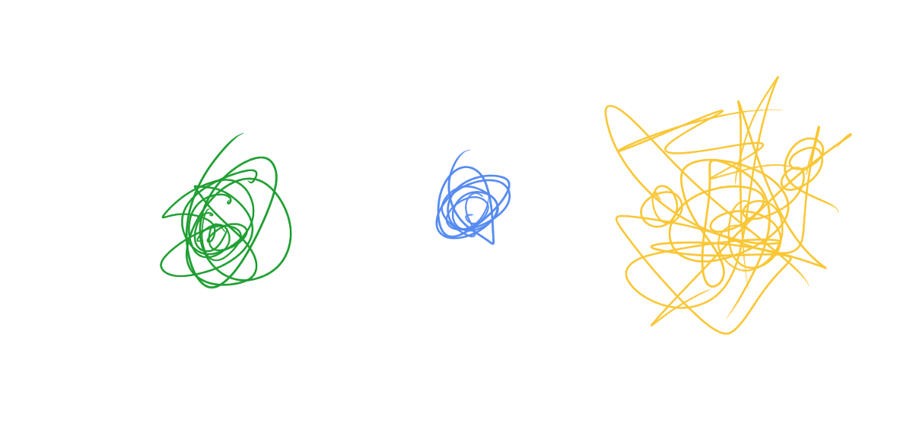
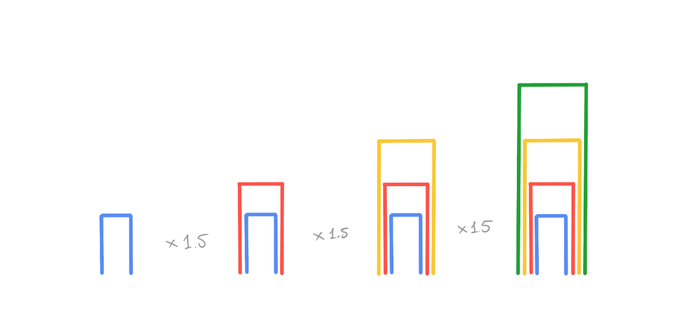
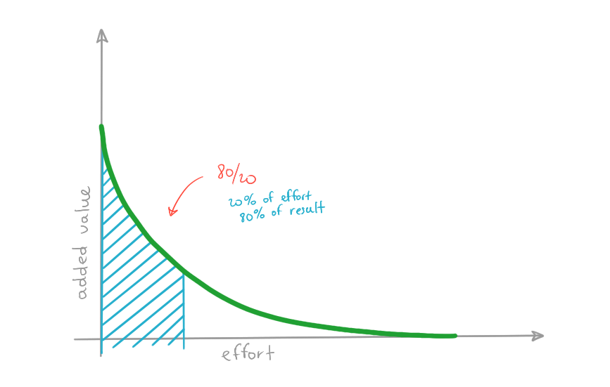

想象一下，除了技术债务外，还需要为所欠金额支付技术税。 每年，工程团队必须准备一张列出所有应纳税事件的表格：采取了多少快捷方式，由于这些快捷方式而产生了多少小时的运营开销，等等。这会使软件工程的工作方式有所不同吗？
# 技术债务和技术税

软件工程中有一个称为“技术债务”的概念。当您做某事时，您知道不正确，但您仍在这样做。 正如一些模因所说的那样，“我们做某件事不是因为它很容易，而是因为它看起来很容易。”所以看起来某件事很容易，（希望）实现它所需的时间更少，但现在却引起了麻烦。 这是技术债务。


一些项目跟踪工具将静态分析工具（例如pmd，findbugs）的输出视为“技术债务”。该方法过长，字符串文字重复，比较不复杂等。……这些发现可能很有用， 但是，如果您有足够的经验，这种检查通常很烦人。 而且显然还远远没有抓住真正的技术债务。 可能会有一个很好的代码，带有来自静态分析工具的大量警告，并且可能有代码处于技术破产的边缘，根据同一工具，它的工作令人难以置信。

因此，技术债务很难通过算法检测出来。 静态分析工具肯定是由聪明人开发的，如果真是这样，他们会做对的。

好吧，那什么是技术债务呢？
# 什么是技术债务

尽管彼此之间是相对的，但显然可以进行衡量：项目“ Aurora”比“ Bravo”拥有更多的技术债务，但是他们两个债务的总和远小于“ Charlie”之一。在这方面，技术债务是 类似于人类可能会经历的感觉和情感：很难以绝对单位说出您对某种咖啡（或茶）的喜欢程度，但是不难给出一个粗略的估算并将其与其他咖啡（或茶）进行比较。


人们也很容易发现技术债务。 通常，您开始一个新项目，然后看到一些奇怪的东西。 您向项目中的某人询问，答案是：“哦，这是技术债务。 我们开了一个问题来清理它，但还没有解决。”

这也是积累的东西。 到处走捷径-很好。 还有更多的切角-看起来不太好，但是该软件可以完成预期的工作。 尽管进行了下一个更改，但是您可能会发现自己添加了一种变通方法来变通您之前所做的快捷方式。 为了使它真正起作用，在部署服务时您需要“关闭”更多细节……慢慢地，但是可以肯定的是，您必须花费越来越多的时间来解决与您尝试的实际更改无关的事情 在系统中做。


尤其令人生畏的是，所有这些快捷方式和变通办法在您获得上下文之前都是不可预测且不合理的。 如果要构建CRUD应用程序，键值存储或字符串处理库，则在查看实现时可以大致了解某些组件的功能。 快捷方式几乎从来都不是这种情况-通常，您需要对用例有一个很好的了解，才能理解为什么用这种方式来完成事情。

这也是不可避免的。 在大多数情况下，该软件的存在是为了向用户添加一些价值，有时并不总是能够拥有所有资源来交付这一价值，而不是采用捷径。

因此，技术债务是一组技术决策和实施细节，导致不必要的复杂性，运行时间，开发和运营开销。
# 技术兴趣

继续讲财务隐喻，如果有债务，就应该有兴趣：花费时间和精力来应对运行和更改充满快捷方式的代码所带来的复杂性。


改变后改变，它遵循复利法则加起来，增加了越来越多的工作。 首先，是更多代码。 然后，这将需要更多的操作工作：如果启用了“ enable_backoff”标志-禁用了“ experimental_fallout”标志，如果更改了跟踪服务中的逻辑-首先请确保更新数据库中的SQL函数，等等。

该系统变得脆弱，需要更多的时间来解决故障，从而留出更少的时间进行常规开发。 需要更快速的修复来解决紧急问题，从而导致更加复杂。 出现了特定类别的“英雄”，即每周加班大胆地扑救火灾并从完全灾难中拯救项目（或显着减小爆炸半径）的人们……
# 债务没有什么坏处

大部分时间都花在扑救火灾上的“技术破产”图景看起来并不好。 但是技术债的问题是，在某些情况下您不必还清债务。

（希望如此）没有技术收集机构会进行持久呼叫并要求去重构服务以使其不具有共享数据库。 或者删除REST协议，并使用适当的RPC工具停止一次又一次地写入客户端。 或将一些逻辑移到一个共同的地方（尽管要小心一点）。 实际上，在大多数情况下，如果不涉及技术债务，管理层会很乐意。 令人沮丧的是，要花两个星期才能移动一个按钮，但是在哪里可以保证如果我们花这两个星期来清理技术债务会更好呢？ 当然，我们必须今天支付利息，但是也许我们不需要再次触摸应用程序的这些部分，还是会重新编写整个模块？

在某些情况下，这并不像听起来那样疯狂。 如果利率是10％，但是您可以获得30％的回报，那么承担尽可能多的债务就更有意义了。 一个很好的例子是当主要用户工作流程和系统设计或多或少地建立起来后便被丢弃的原型。 或者，当产品的成功超过系统的计划容量时，在开发可处理更大规模的新系统的同时，使系统保持快速补丁可能是有意义的。

但是，即使您不打算很快放弃该项目，也要承担一些技术债务。 上面的示例描述了如果太少注意解决问题会发生什么。 但是，没有技术债务就像努力争取100％的测试覆盖率：您必须非常努力才能获得最后的百分比，并且几乎没有得到任何回报。


关键在天平上。

但是您怎么知道平衡是否正确？ 你没有，那是不可能的。 因此，两种策略要么试图猜测何时偿还某些债务（本质上是赌博），要么有条不紊地偿还债务。
```
(本文翻译自Yan Babitski的文章《Technical debt and technical tax》，参考：https://medium.com/swlh/technical-debt-and-technical-tax-839ebd104958)
```
