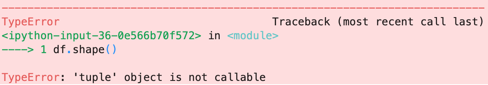

# 奖励：学会快速解决错误

这是一个很大的话题，没有引起足够的重视，以至于我一直在讨论写一篇完整的文章。 取而代之的是，这是一个奖励部分-5个步骤，可更快解决错误。

> Translation: you called shape as method when it doesn’t exist, you wanted to get an attribute.


每个程序员都会看到很多错误。 经验丰富后，大多数事情不会耸耸肩，因为您可以在一分钟内解决它们。

但是，一开始，解决错误可能需要花费20倍的时间。 对于初学者而言，错误可能会让您感到自己陷入了脚踝深处的泥泞之中。

> Muddy Errors. Source: https://pixabay.com/


undefined
## 因此，您遇到了错误，该怎么办？
+ 寻找拼写错误-缺少括号或拼写错误的变量或函数。 语法突出显示可以在此处提供帮助。 务必在提供突出显示代码的软件中进行键入，以提高避免或快速修复缩进，不平衡括号和类似错误的机会。 有很多好的代码编辑器可供选择。 如果您刚刚起步，我建议您使用VSCode-它具有最大的市场份额，它是免费的，并且具有便捷的功能。
+ 首先阅读错误消息堆栈跟踪的顶部和底部。 中间的代码通常不太有用。 然后查看您的代码，根据错误消息中的线索，看看是否可以找出问题所在。 如果您无法快速解码错误消息，请将消息的最后一行复制并粘贴到Google中（如果使用的是Python。在堆栈跟踪之前，其他语言可能会显示错误消息）。 新编码员最大的错误是没有足够快地向Google提出错误消息。

> Source: https://pixabay.com/


3.过滤在线资源以将小麦与谷壳分离。 🌾在这里，一些启发式方法可以帮助您更快地找到更高质量的资源。 😀

Stack Overflow，Medium，Reddit，Hacker News，Dev和其他在线社区都有反馈指标，例如投票或鼓掌，以显示目标内容。 这些指标并不完美，但通常效果很好。 Stack Overflow，Towards Data Science Medium出版物，有问题的回购的GitHub问题，语言或库的官方文档是我找到最多解决方案的站点。

> On target. Source: https://pixabay.com/


Google搜索结果中博客质量的高低可能会引起轰动。 如果您使用的是Python，我可以根据我的经验为您推荐一些不错的网站：
+ 真正的Python
+ 数据学校
+ Dataquest网志
+ DataCamp博客
+ 实用商务Python
+ 克里斯·阿尔邦

4.避免使用较旧的资源。 对于大多数问题，您需要不超过几年的资源。 在Google上寻找错误的解决方案时，请过滤掉旧结果-通过对搜索参数进行时间装箱或在查看结果摘要时非正式地进行过滤。

> Time limiting search results with Google search tools


如果您刚开始使用Python，那么2009年以来关于Python 2的内容不太可能对您有所帮助。 🐍

API不断发展，今天通常不建议采用做事方式。 您更有可能在相对较近期的结果中找到适用的答案。 📆

如果您最初的尝试不成功，则值得在下一张通关中浏览旧帖子和质量较低的网站。

5.了解错误代码的含义。 这是Python的常见错误代码和说明的列表。 这是一个非常不错的流程图，可帮助您解决常见的Python错误。

如果使用Python pandas库进行数据操作，则存在常见错误。 这是我用Jupyter笔记本制作的GitHub Gist，其中包含常见错误以及如何解决这些错误：
```
{
 "cells": [
  {
   "cell_type": "code",
   "execution_count": 1,
   "metadata": {},
   "outputs": [],
   "source": [
    "import pandas as pd\n",
    "import numpy as np"
   ]
  },
  {
   "cell_type": "markdown",
   "metadata": {},
   "source": [
    "Using the pandas library by the name `pandas` when you created an alias for it."
   ]
  },
  {
   "cell_type": "code",
   "execution_count": 2,
   "metadata": {},
   "outputs": [
    {
     "ename": "NameError",
     "evalue": "name 'pandas' is not defined",
     "output_type": "error",
     "traceback": [
      "\u001b[0;31m---------------------------------------------------------------------------\u001b[0m",
      "\u001b[0;31mNameError\u001b[0m                                 Traceback (most recent call last)",
      "\u001b[0;32m<ipython-input-2-068244f7ed4b>\u001b[0m in \u001b[0;36m<module>\u001b[0;34m\u001b[0m\n\u001b[0;32m----> 1\u001b[0;31m \u001b[0mpandas\u001b[0m\u001b[0;34m.\u001b[0m\u001b[0m__version__\u001b[0m\u001b[0;34m\u001b[0m\u001b[0;34m\u001b[0m\u001b[0m\n\u001b[0m",
      "\u001b[0;31mNameError\u001b[0m: name 'pandas' is not defined"
     ]
    }
   ],
   "source": [
    "pandas.__version__"
   ]
  },
  {
   "cell_type": "code",
   "execution_count": 6,
   "metadata": {},
   "outputs": [
    {
     "data": {
      "text/plain": [
       "'1.0.1'"
      ]
     },
     "execution_count": 6,
     "metadata": {},
     "output_type": "execute_result"
    }
   ],
   "source": [
    "pd.__version__"
   ]
  },
  {
   "cell_type": "markdown",
   "metadata": {},
   "source": [
    "### Make a DataFrame"
   ]
  },
  {
   "cell_type": "code",
   "execution_count": 21,
   "metadata": {},
   "outputs": [],
   "source": [
    "df = pd.DataFrame(dict(col1=['a', 'b', 'c']), index=['first', 'second', 'third'])"
   ]
  },
  {
   "cell_type": "code",
   "execution_count": 22,
   "metadata": {},
   "outputs": [
    {
     "data": {
      "text/html": [
       "<div>\n",
       "<style scoped>\n",
       "    .dataframe tbody tr th:only-of-type {\n",
       "        vertical-align: middle;\n",
       "    }\n",
       "\n",
       "    .dataframe tbody tr th {\n",
       "        vertical-align: top;\n",
       "    }\n",
       "\n",
       "    .dataframe thead th {\n",
       "        text-align: right;\n",
       "    }\n",
       "</style>\n",
       "<table border=\"1\" class=\"dataframe\">\n",
       "  <thead>\n",
       "    <tr style=\"text-align: right;\">\n",
       "      <th></th>\n",
       "      <th>col1</th>\n",
       "    </tr>\n",
       "  </thead>\n",
       "  <tbody>\n",
       "    <tr>\n",
       "      <th>first</th>\n",
       "      <td>a</td>\n",
       "    </tr>\n",
       "    <tr>\n",
       "      <th>second</th>\n",
       "      <td>b</td>\n",
       "    </tr>\n",
       "    <tr>\n",
       "      <th>third</th>\n",
       "      <td>c</td>\n",
       "    </tr>\n",
       "  </tbody>\n",
       "</table>\n",
       "</div>"
      ],
      "text/plain": [
       "       col1\n",
       "first     a\n",
       "second    b\n",
       "third     c"
      ]
     },
     "execution_count": 22,
     "metadata": {},
     "output_type": "execute_result"
    }
   ],
   "source": [
    "df"
   ]
  },
  {
   "cell_type": "markdown",
   "metadata": {},
   "source": [
    "Calling `sort_values()` on a DataFrame without an column name to sort by."
   ]
  },
  {
   "cell_type": "code",
   "execution_count": 23,
   "metadata": {},
   "outputs": [
    {
     "ename": "TypeError",
     "evalue": "sort_values() missing 1 required positional argument: 'by'",
     "output_type": "error",
     "traceback": [
      "\u001b[0;31m---------------------------------------------------------------------------\u001b[0m",
      "\u001b[0;31mTypeError\u001b[0m                                 Traceback (most recent call last)",
      "\u001b[0;32m<ipython-input-23-9baf0daa5fc6>\u001b[0m in \u001b[0;36m<module>\u001b[0;34m\u001b[0m\n\u001b[0;32m----> 1\u001b[0;31m \u001b[0mdf\u001b[0m\u001b[0;34m.\u001b[0m\u001b[0msort_values\u001b[0m\u001b[0;34m(\u001b[0m\u001b[0;34m)\u001b[0m\u001b[0;34m\u001b[0m\u001b[0;34m\u001b[0m\u001b[0m\n\u001b[0m",
      "\u001b[0;31mTypeError\u001b[0m: sort_values() missing 1 required positional argument: 'by'"
     ]
    }
   ],
   "source": [
    "df.sort_values()"
   ]
  },
  {
   "cell_type": "code",
   "execution_count": 24,
   "metadata": {},
   "outputs": [
    {
     "data": {
      "text/html": [
       "<div>\n",
       "<style scoped>\n",
       "    .dataframe tbody tr th:only-of-type {\n",
       "        vertical-align: middle;\n",
       "    }\n",
       "\n",
       "    .dataframe tbody tr th {\n",
       "        vertical-align: top;\n",
       "    }\n",
       "\n",
       "    .dataframe thead th {\n",
       "        text-align: right;\n",
       "    }\n",
       "</style>\n",
       "<table border=\"1\" class=\"dataframe\">\n",
       "  <thead>\n",
       "    <tr style=\"text-align: right;\">\n",
       "      <th></th>\n",
       "      <th>col1</th>\n",
       "    </tr>\n",
       "  </thead>\n",
       "  <tbody>\n",
       "    <tr>\n",
       "      <th>first</th>\n",
       "      <td>a</td>\n",
       "    </tr>\n",
       "    <tr>\n",
       "      <th>second</th>\n",
       "      <td>b</td>\n",
       "    </tr>\n",
       "    <tr>\n",
       "      <th>third</th>\n",
       "      <td>c</td>\n",
       "    </tr>\n",
       "  </tbody>\n",
       "</table>\n",
       "</div>"
      ],
      "text/plain": [
       "       col1\n",
       "first     a\n",
       "second    b\n",
       "third     c"
      ]
     },
     "execution_count": 24,
     "metadata": {},
     "output_type": "execute_result"
    }
   ],
   "source": [
    "df.sort_values('col1')"
   ]
  },
  {
   "cell_type": "markdown",
   "metadata": {},
   "source": [
    "Calling a Series method on a DataFrame when there is no DataFrame method of the same name."
   ]
  },
  {
   "cell_type": "code",
   "execution_count": 25,
   "metadata": {},
   "outputs": [
    {
     "ename": "AttributeError",
     "evalue": "'DataFrame' object has no attribute 'value_counts'",
     "output_type": "error",
     "traceback": [
      "\u001b[0;31m---------------------------------------------------------------------------\u001b[0m",
      "\u001b[0;31mAttributeError\u001b[0m                            Traceback (most recent call last)",
      "\u001b[0;32m<ipython-input-25-986e25863b45>\u001b[0m in \u001b[0;36m<module>\u001b[0;34m\u001b[0m\n\u001b[0;32m----> 1\u001b[0;31m \u001b[0mdf\u001b[0m\u001b[0;34m.\u001b[0m\u001b[0mvalue_counts\u001b[0m\u001b[0;34m(\u001b[0m\u001b[0;34m)\u001b[0m\u001b[0;34m\u001b[0m\u001b[0;34m\u001b[0m\u001b[0m\n\u001b[0m",
      "\u001b[0;32m~/miniconda3/envs/main/lib/python3.7/site-packages/pandas/core/generic.py\u001b[0m in \u001b[0;36m__getattr__\u001b[0;34m(self, name)\u001b[0m\n\u001b[1;32m   5272\u001b[0m             \u001b[0;32mif\u001b[0m \u001b[0mself\u001b[0m\u001b[0;34m.\u001b[0m\u001b[0m_info_axis\u001b[0m\u001b[0;34m.\u001b[0m\u001b[0m_can_hold_identifiers_and_holds_name\u001b[0m\u001b[0;34m(\u001b[0m\u001b[0mname\u001b[0m\u001b[0;34m)\u001b[0m\u001b[0;34m:\u001b[0m\u001b[0;34m\u001b[0m\u001b[0;34m\u001b[0m\u001b[0m\n\u001b[1;32m   5273\u001b[0m                 \u001b[0;32mreturn\u001b[0m \u001b[0mself\u001b[0m\u001b[0;34m[\u001b[0m\u001b[0mname\u001b[0m\u001b[0;34m]\u001b[0m\u001b[0;34m\u001b[0m\u001b[0;34m\u001b[0m\u001b[0m\n\u001b[0;32m-> 5274\u001b[0;31m             \u001b[0;32mreturn\u001b[0m \u001b[0mobject\u001b[0m\u001b[0;34m.\u001b[0m\u001b[0m__getattribute__\u001b[0m\u001b[0;34m(\u001b[0m\u001b[0mself\u001b[0m\u001b[0;34m,\u001b[0m \u001b[0mname\u001b[0m\u001b[0;34m)\u001b[0m\u001b[0;34m\u001b[0m\u001b[0;34m\u001b[0m\u001b[0m\n\u001b[0m\u001b[1;32m   5275\u001b[0m \u001b[0;34m\u001b[0m\u001b[0m\n\u001b[1;32m   5276\u001b[0m     \u001b[0;32mdef\u001b[0m \u001b[0m__setattr__\u001b[0m\u001b[0;34m(\u001b[0m\u001b[0mself\u001b[0m\u001b[0;34m,\u001b[0m \u001b[0mname\u001b[0m\u001b[0;34m:\u001b[0m \u001b[0mstr\u001b[0m\u001b[0;34m,\u001b[0m \u001b[0mvalue\u001b[0m\u001b[0;34m)\u001b[0m \u001b[0;34m->\u001b[0m \u001b[0;32mNone\u001b[0m\u001b[0;34m:\u001b[0m\u001b[0;34m\u001b[0m\u001b[0;34m\u001b[0m\u001b[0m\n",
      "\u001b[0;31mAttributeError\u001b[0m: 'DataFrame' object has no attribute 'value_counts'"
     ]
    }
   ],
   "source": [
    "df.value_counts()"
   ]
  },
  {
   "cell_type": "code",
   "execution_count": 26,
   "metadata": {},
   "outputs": [
    {
     "data": {
      "text/plain": [
       "b    1\n",
       "c    1\n",
       "a    1\n",
       "Name: col1, dtype: int64"
      ]
     },
     "execution_count": 26,
     "metadata": {},
     "output_type": "execute_result"
    }
   ],
   "source": [
    "df['col1'].value_counts()"
   ]
  },
  {
   "cell_type": "markdown",
   "metadata": {},
   "source": [
    "Using `.iloc[]` to try to index by row name."
   ]
  },
  {
   "cell_type": "code",
   "execution_count": 27,
   "metadata": {},
   "outputs": [
    {
     "ename": "TypeError",
     "evalue": "Cannot index by location index with a non-integer key",
     "output_type": "error",
     "traceback": [
      "\u001b[0;31m---------------------------------------------------------------------------\u001b[0m",
      "\u001b[0;31mTypeError\u001b[0m                                 Traceback (most recent call last)",
      "\u001b[0;32m<ipython-input-27-37589c22a003>\u001b[0m in \u001b[0;36m<module>\u001b[0;34m\u001b[0m\n\u001b[0;32m----> 1\u001b[0;31m \u001b[0mdf\u001b[0m\u001b[0;34m.\u001b[0m\u001b[0miloc\u001b[0m\u001b[0;34m[\u001b[0m\u001b[0;34m'a'\u001b[0m\u001b[0;34m]\u001b[0m\u001b[0;34m\u001b[0m\u001b[0;34m\u001b[0m\u001b[0m\n\u001b[0m",
      "\u001b[0;32m~/miniconda3/envs/main/lib/python3.7/site-packages/pandas/core/indexing.py\u001b[0m in \u001b[0;36m__getitem__\u001b[0;34m(self, key)\u001b[0m\n\u001b[1;32m   1765\u001b[0m \u001b[0;34m\u001b[0m\u001b[0m\n\u001b[1;32m   1766\u001b[0m             \u001b[0mmaybe_callable\u001b[0m \u001b[0;34m=\u001b[0m \u001b[0mcom\u001b[0m\u001b[0;34m.\u001b[0m\u001b[0mapply_if_callable\u001b[0m\u001b[0;34m(\u001b[0m\u001b[0mkey\u001b[0m\u001b[0;34m,\u001b[0m \u001b[0mself\u001b[0m\u001b[0;34m.\u001b[0m\u001b[0mobj\u001b[0m\u001b[0;34m)\u001b[0m\u001b[0;34m\u001b[0m\u001b[0;34m\u001b[0m\u001b[0m\n\u001b[0;32m-> 1767\u001b[0;31m             \u001b[0;32mreturn\u001b[0m \u001b[0mself\u001b[0m\u001b[0;34m.\u001b[0m\u001b[0m_getitem_axis\u001b[0m\u001b[0;34m(\u001b[0m\u001b[0mmaybe_callable\u001b[0m\u001b[0;34m,\u001b[0m \u001b[0maxis\u001b[0m\u001b[0;34m=\u001b[0m\u001b[0maxis\u001b[0m\u001b[0;34m)\u001b[0m\u001b[0;34m\u001b[0m\u001b[0;34m\u001b[0m\u001b[0m\n\u001b[0m\u001b[1;32m   1768\u001b[0m \u001b[0;34m\u001b[0m\u001b[0m\n\u001b[1;32m   1769\u001b[0m     \u001b[0;32mdef\u001b[0m \u001b[0m_is_scalar_access\u001b[0m\u001b[0;34m(\u001b[0m\u001b[0mself\u001b[0m\u001b[0;34m,\u001b[0m \u001b[0mkey\u001b[0m\u001b[0;34m:\u001b[0m \u001b[0mTuple\u001b[0m\u001b[0;34m)\u001b[0m\u001b[0;34m:\u001b[0m\u001b[0;34m\u001b[0m\u001b[0;34m\u001b[0m\u001b[0m\n",
      "\u001b[0;32m~/miniconda3/envs/main/lib/python3.7/site-packages/pandas/core/indexing.py\u001b[0m in \u001b[0;36m_getitem_axis\u001b[0;34m(self, key, axis)\u001b[0m\n\u001b[1;32m   2132\u001b[0m             \u001b[0mkey\u001b[0m \u001b[0;34m=\u001b[0m \u001b[0mitem_from_zerodim\u001b[0m\u001b[0;34m(\u001b[0m\u001b[0mkey\u001b[0m\u001b[0;34m)\u001b[0m\u001b[0;34m\u001b[0m\u001b[0;34m\u001b[0m\u001b[0m\n\u001b[1;32m   2133\u001b[0m             \u001b[0;32mif\u001b[0m \u001b[0;32mnot\u001b[0m \u001b[0mis_integer\u001b[0m\u001b[0;34m(\u001b[0m\u001b[0mkey\u001b[0m\u001b[0;34m)\u001b[0m\u001b[0;34m:\u001b[0m\u001b[0;34m\u001b[0m\u001b[0;34m\u001b[0m\u001b[0m\n\u001b[0;32m-> 2134\u001b[0;31m                 \u001b[0;32mraise\u001b[0m \u001b[0mTypeError\u001b[0m\u001b[0;34m(\u001b[0m\u001b[0;34m\"Cannot index by location index with a non-integer key\"\u001b[0m\u001b[0;34m)\u001b[0m\u001b[0;34m\u001b[0m\u001b[0;34m\u001b[0m\u001b[0m\n\u001b[0m\u001b[1;32m   2135\u001b[0m \u001b[0;34m\u001b[0m\u001b[0m\n\u001b[1;32m   2136\u001b[0m             \u001b[0;31m# validate the location\u001b[0m\u001b[0;34m\u001b[0m\u001b[0;34m\u001b[0m\u001b[0;34m\u001b[0m\u001b[0m\n",
      "\u001b[0;31mTypeError\u001b[0m: Cannot index by location index with a non-integer key"
     ]
    }
   ],
   "source": [
    "df.iloc['a']"
   ]
  },
  {
   "cell_type": "code",
   "execution_count": 29,
   "metadata": {},
   "outputs": [
    {
     "data": {
      "text/plain": [
       "col1    b\n",
       "Name: second, dtype: object"
      ]
     },
     "execution_count": 29,
     "metadata": {},
     "output_type": "execute_result"
    }
   ],
   "source": [
    "df.loc['second']"
   ]
  },
  {
   "cell_type": "markdown",
   "metadata": {},
   "source": [
    "Subsetting by an row index number that doesn't exist."
   ]
  },
  {
   "cell_type": "code",
   "execution_count": 19,
   "metadata": {},
   "outputs": [
    {
     "ename": "IndexError",
     "evalue": "single positional indexer is out-of-bounds",
     "output_type": "error",
     "traceback": [
      "\u001b[0;31m---------------------------------------------------------------------------\u001b[0m",
      "\u001b[0;31mIndexError\u001b[0m                                Traceback (most recent call last)",
      "\u001b[0;32m<ipython-input-19-dd7c84f36f80>\u001b[0m in \u001b[0;36m<module>\u001b[0;34m\u001b[0m\n\u001b[0;32m----> 1\u001b[0;31m \u001b[0mdf\u001b[0m\u001b[0;34m.\u001b[0m\u001b[0miloc\u001b[0m\u001b[0;34m[\u001b[0m\u001b[0;36m3\u001b[0m\u001b[0;34m]\u001b[0m\u001b[0;34m\u001b[0m\u001b[0;34m\u001b[0m\u001b[0m\n\u001b[0m",
      "\u001b[0;32m~/miniconda3/envs/main/lib/python3.7/site-packages/pandas/core/indexing.py\u001b[0m in \u001b[0;36m__getitem__\u001b[0;34m(self, key)\u001b[0m\n\u001b[1;32m   1765\u001b[0m \u001b[0;34m\u001b[0m\u001b[0m\n\u001b[1;32m   1766\u001b[0m             \u001b[0mmaybe_callable\u001b[0m \u001b[0;34m=\u001b[0m \u001b[0mcom\u001b[0m\u001b[0;34m.\u001b[0m\u001b[0mapply_if_callable\u001b[0m\u001b[0;34m(\u001b[0m\u001b[0mkey\u001b[0m\u001b[0;34m,\u001b[0m \u001b[0mself\u001b[0m\u001b[0;34m.\u001b[0m\u001b[0mobj\u001b[0m\u001b[0;34m)\u001b[0m\u001b[0;34m\u001b[0m\u001b[0;34m\u001b[0m\u001b[0m\n\u001b[0;32m-> 1767\u001b[0;31m             \u001b[0;32mreturn\u001b[0m \u001b[0mself\u001b[0m\u001b[0;34m.\u001b[0m\u001b[0m_getitem_axis\u001b[0m\u001b[0;34m(\u001b[0m\u001b[0mmaybe_callable\u001b[0m\u001b[0;34m,\u001b[0m \u001b[0maxis\u001b[0m\u001b[0;34m=\u001b[0m\u001b[0maxis\u001b[0m\u001b[0;34m)\u001b[0m\u001b[0;34m\u001b[0m\u001b[0;34m\u001b[0m\u001b[0m\n\u001b[0m\u001b[1;32m   1768\u001b[0m \u001b[0;34m\u001b[0m\u001b[0m\n\u001b[1;32m   1769\u001b[0m     \u001b[0;32mdef\u001b[0m \u001b[0m_is_scalar_access\u001b[0m\u001b[0;34m(\u001b[0m\u001b[0mself\u001b[0m\u001b[0;34m,\u001b[0m \u001b[0mkey\u001b[0m\u001b[0;34m:\u001b[0m \u001b[0mTuple\u001b[0m\u001b[0;34m)\u001b[0m\u001b[0;34m:\u001b[0m\u001b[0;34m\u001b[0m\u001b[0;34m\u001b[0m\u001b[0m\n",
      "\u001b[0;32m~/miniconda3/envs/main/lib/python3.7/site-packages/pandas/core/indexing.py\u001b[0m in \u001b[0;36m_getitem_axis\u001b[0;34m(self, key, axis)\u001b[0m\n\u001b[1;32m   2135\u001b[0m \u001b[0;34m\u001b[0m\u001b[0m\n\u001b[1;32m   2136\u001b[0m             \u001b[0;31m# validate the location\u001b[0m\u001b[0;34m\u001b[0m\u001b[0;34m\u001b[0m\u001b[0;34m\u001b[0m\u001b[0m\n\u001b[0;32m-> 2137\u001b[0;31m             \u001b[0mself\u001b[0m\u001b[0;34m.\u001b[0m\u001b[0m_validate_integer\u001b[0m\u001b[0;34m(\u001b[0m\u001b[0mkey\u001b[0m\u001b[0;34m,\u001b[0m \u001b[0maxis\u001b[0m\u001b[0;34m)\u001b[0m\u001b[0;34m\u001b[0m\u001b[0;34m\u001b[0m\u001b[0m\n\u001b[0m\u001b[1;32m   2138\u001b[0m \u001b[0;34m\u001b[0m\u001b[0m\n\u001b[1;32m   2139\u001b[0m             \u001b[0;32mreturn\u001b[0m \u001b[0mself\u001b[0m\u001b[0;34m.\u001b[0m\u001b[0m_get_loc\u001b[0m\u001b[0;34m(\u001b[0m\u001b[0mkey\u001b[0m\u001b[0;34m,\u001b[0m \u001b[0maxis\u001b[0m\u001b[0;34m=\u001b[0m\u001b[0maxis\u001b[0m\u001b[0;34m)\u001b[0m\u001b[0;34m\u001b[0m\u001b[0;34m\u001b[0m\u001b[0m\n",
      "\u001b[0;32m~/miniconda3/envs/main/lib/python3.7/site-packages/pandas/core/indexing.py\u001b[0m in \u001b[0;36m_validate_integer\u001b[0;34m(self, key, axis)\u001b[0m\n\u001b[1;32m   2060\u001b[0m         \u001b[0mlen_axis\u001b[0m \u001b[0;34m=\u001b[0m \u001b[0mlen\u001b[0m\u001b[0;34m(\u001b[0m\u001b[0mself\u001b[0m\u001b[0;34m.\u001b[0m\u001b[0mobj\u001b[0m\u001b[0;34m.\u001b[0m\u001b[0m_get_axis\u001b[0m\u001b[0;34m(\u001b[0m\u001b[0maxis\u001b[0m\u001b[0;34m)\u001b[0m\u001b[0;34m)\u001b[0m\u001b[0;34m\u001b[0m\u001b[0;34m\u001b[0m\u001b[0m\n\u001b[1;32m   2061\u001b[0m         \u001b[0;32mif\u001b[0m \u001b[0mkey\u001b[0m \u001b[0;34m>=\u001b[0m \u001b[0mlen_axis\u001b[0m \u001b[0;32mor\u001b[0m \u001b[0mkey\u001b[0m \u001b[0;34m<\u001b[0m \u001b[0;34m-\u001b[0m\u001b[0mlen_axis\u001b[0m\u001b[0;34m:\u001b[0m\u001b[0;34m\u001b[0m\u001b[0;34m\u001b[0m\u001b[0m\n\u001b[0;32m-> 2062\u001b[0;31m             \u001b[0;32mraise\u001b[0m \u001b[0mIndexError\u001b[0m\u001b[0;34m(\u001b[0m\u001b[0;34m\"single positional indexer is out-of-bounds\"\u001b[0m\u001b[0;34m)\u001b[0m\u001b[0;34m\u001b[0m\u001b[0;34m\u001b[0m\u001b[0m\n\u001b[0m\u001b[1;32m   2063\u001b[0m \u001b[0;34m\u001b[0m\u001b[0m\n\u001b[1;32m   2064\u001b[0m     \u001b[0;32mdef\u001b[0m \u001b[0m_getitem_tuple\u001b[0m\u001b[0;34m(\u001b[0m\u001b[0mself\u001b[0m\u001b[0;34m,\u001b[0m \u001b[0mtup\u001b[0m\u001b[0;34m:\u001b[0m \u001b[0mTuple\u001b[0m\u001b[0;34m)\u001b[0m\u001b[0;34m:\u001b[0m\u001b[0;34m\u001b[0m\u001b[0;34m\u001b[0m\u001b[0m\n",
      "\u001b[0;31mIndexError\u001b[0m: single positional indexer is out-of-bounds"
     ]
    }
   ],
   "source": [
    "df.iloc[3]"
   ]
  },
  {
   "cell_type": "code",
   "execution_count": 18,
   "metadata": {},
   "outputs": [
    {
     "data": {
      "text/plain": [
       "col1    c\n",
       "Name: 2, dtype: object"
      ]
     },
     "execution_count": 18,
     "metadata": {},
     "output_type": "execute_result"
    }
   ],
   "source": [
    "df.iloc[2]"
   ]
  },
  {
   "cell_type": "markdown",
   "metadata": {},
   "source": [
    "Subsetting a column with a column name that doesn't exist."
   ]
  },
  {
   "cell_type": "code",
   "execution_count": 15,
   "metadata": {},
   "outputs": [
    {
     "ename": "KeyError",
     "evalue": "'col2'",
     "output_type": "error",
     "traceback": [
      "\u001b[0;31m---------------------------------------------------------------------------\u001b[0m",
      "\u001b[0;31mKeyError\u001b[0m                                  Traceback (most recent call last)",
      "\u001b[0;32m~/miniconda3/envs/main/lib/python3.7/site-packages/pandas/core/indexes/base.py\u001b[0m in \u001b[0;36mget_loc\u001b[0;34m(self, key, method, tolerance)\u001b[0m\n\u001b[1;32m   2645\u001b[0m             \u001b[0;32mtry\u001b[0m\u001b[0;34m:\u001b[0m\u001b[0;34m\u001b[0m\u001b[0;34m\u001b[0m\u001b[0m\n\u001b[0;32m-> 2646\u001b[0;31m                 \u001b[0;32mreturn\u001b[0m \u001b[0mself\u001b[0m\u001b[0;34m.\u001b[0m\u001b[0m_engine\u001b[0m\u001b[0;34m.\u001b[0m\u001b[0mget_loc\u001b[0m\u001b[0;34m(\u001b[0m\u001b[0mkey\u001b[0m\u001b[0;34m)\u001b[0m\u001b[0;34m\u001b[0m\u001b[0;34m\u001b[0m\u001b[0m\n\u001b[0m\u001b[1;32m   2647\u001b[0m             \u001b[0;32mexcept\u001b[0m \u001b[0mKeyError\u001b[0m\u001b[0;34m:\u001b[0m\u001b[0;34m\u001b[0m\u001b[0;34m\u001b[0m\u001b[0m\n",
      "\u001b[0;32mpandas/_libs/index.pyx\u001b[0m in \u001b[0;36mpandas._libs.index.IndexEngine.get_loc\u001b[0;34m()\u001b[0m\n",
      "\u001b[0;32mpandas/_libs/index.pyx\u001b[0m in \u001b[0;36mpandas._libs.index.IndexEngine.get_loc\u001b[0;34m()\u001b[0m\n",
      "\u001b[0;32mpandas/_libs/hashtable_class_helper.pxi\u001b[0m in \u001b[0;36mpandas._libs.hashtable.PyObjectHashTable.get_item\u001b[0;34m()\u001b[0m\n",
      "\u001b[0;32mpandas/_libs/hashtable_class_helper.pxi\u001b[0m in \u001b[0;36mpandas._libs.hashtable.PyObjectHashTable.get_item\u001b[0;34m()\u001b[0m\n",
      "\u001b[0;31mKeyError\u001b[0m: 'col2'",
      "\nDuring handling of the above exception, another exception occurred:\n",
      "\u001b[0;31mKeyError\u001b[0m                                  Traceback (most recent call last)",
      "\u001b[0;32m<ipython-input-15-fbc8de4a449f>\u001b[0m in \u001b[0;36m<module>\u001b[0;34m\u001b[0m\n\u001b[0;32m----> 1\u001b[0;31m \u001b[0mdf\u001b[0m\u001b[0;34m[\u001b[0m\u001b[0;34m'col2'\u001b[0m\u001b[0;34m]\u001b[0m\u001b[0;34m\u001b[0m\u001b[0;34m\u001b[0m\u001b[0m\n\u001b[0m",
      "\u001b[0;32m~/miniconda3/envs/main/lib/python3.7/site-packages/pandas/core/frame.py\u001b[0m in \u001b[0;36m__getitem__\u001b[0;34m(self, key)\u001b[0m\n\u001b[1;32m   2798\u001b[0m             \u001b[0;32mif\u001b[0m \u001b[0mself\u001b[0m\u001b[0;34m.\u001b[0m\u001b[0mcolumns\u001b[0m\u001b[0;34m.\u001b[0m\u001b[0mnlevels\u001b[0m \u001b[0;34m>\u001b[0m \u001b[0;36m1\u001b[0m\u001b[0;34m:\u001b[0m\u001b[0;34m\u001b[0m\u001b[0;34m\u001b[0m\u001b[0m\n\u001b[1;32m   2799\u001b[0m                 \u001b[0;32mreturn\u001b[0m \u001b[0mself\u001b[0m\u001b[0;34m.\u001b[0m\u001b[0m_getitem_multilevel\u001b[0m\u001b[0;34m(\u001b[0m\u001b[0mkey\u001b[0m\u001b[0;34m)\u001b[0m\u001b[0;34m\u001b[0m\u001b[0;34m\u001b[0m\u001b[0m\n\u001b[0;32m-> 2800\u001b[0;31m             \u001b[0mindexer\u001b[0m \u001b[0;34m=\u001b[0m \u001b[0mself\u001b[0m\u001b[0;34m.\u001b[0m\u001b[0mcolumns\u001b[0m\u001b[0;34m.\u001b[0m\u001b[0mget_loc\u001b[0m\u001b[0;34m(\u001b[0m\u001b[0mkey\u001b[0m\u001b[0;34m)\u001b[0m\u001b[0;34m\u001b[0m\u001b[0;34m\u001b[0m\u001b[0m\n\u001b[0m\u001b[1;32m   2801\u001b[0m             \u001b[0;32mif\u001b[0m \u001b[0mis_integer\u001b[0m\u001b[0;34m(\u001b[0m\u001b[0mindexer\u001b[0m\u001b[0;34m)\u001b[0m\u001b[0;34m:\u001b[0m\u001b[0;34m\u001b[0m\u001b[0;34m\u001b[0m\u001b[0m\n\u001b[1;32m   2802\u001b[0m                 \u001b[0mindexer\u001b[0m \u001b[0;34m=\u001b[0m \u001b[0;34m[\u001b[0m\u001b[0mindexer\u001b[0m\u001b[0;34m]\u001b[0m\u001b[0;34m\u001b[0m\u001b[0;34m\u001b[0m\u001b[0m\n",
      "\u001b[0;32m~/miniconda3/envs/main/lib/python3.7/site-packages/pandas/core/indexes/base.py\u001b[0m in \u001b[0;36mget_loc\u001b[0;34m(self, key, method, tolerance)\u001b[0m\n\u001b[1;32m   2646\u001b[0m                 \u001b[0;32mreturn\u001b[0m \u001b[0mself\u001b[0m\u001b[0;34m.\u001b[0m\u001b[0m_engine\u001b[0m\u001b[0;34m.\u001b[0m\u001b[0mget_loc\u001b[0m\u001b[0;34m(\u001b[0m\u001b[0mkey\u001b[0m\u001b[0;34m)\u001b[0m\u001b[0;34m\u001b[0m\u001b[0;34m\u001b[0m\u001b[0m\n\u001b[1;32m   2647\u001b[0m             \u001b[0;32mexcept\u001b[0m \u001b[0mKeyError\u001b[0m\u001b[0;34m:\u001b[0m\u001b[0;34m\u001b[0m\u001b[0;34m\u001b[0m\u001b[0m\n\u001b[0;32m-> 2648\u001b[0;31m                 \u001b[0;32mreturn\u001b[0m \u001b[0mself\u001b[0m\u001b[0;34m.\u001b[0m\u001b[0m_engine\u001b[0m\u001b[0;34m.\u001b[0m\u001b[0mget_loc\u001b[0m\u001b[0;34m(\u001b[0m\u001b[0mself\u001b[0m\u001b[0;34m.\u001b[0m\u001b[0m_maybe_cast_indexer\u001b[0m\u001b[0;34m(\u001b[0m\u001b[0mkey\u001b[0m\u001b[0;34m)\u001b[0m\u001b[0;34m)\u001b[0m\u001b[0;34m\u001b[0m\u001b[0;34m\u001b[0m\u001b[0m\n\u001b[0m\u001b[1;32m   2649\u001b[0m         \u001b[0mindexer\u001b[0m \u001b[0;34m=\u001b[0m \u001b[0mself\u001b[0m\u001b[0;34m.\u001b[0m\u001b[0mget_indexer\u001b[0m\u001b[0;34m(\u001b[0m\u001b[0;34m[\u001b[0m\u001b[0mkey\u001b[0m\u001b[0;34m]\u001b[0m\u001b[0;34m,\u001b[0m \u001b[0mmethod\u001b[0m\u001b[0;34m=\u001b[0m\u001b[0mmethod\u001b[0m\u001b[0;34m,\u001b[0m \u001b[0mtolerance\u001b[0m\u001b[0;34m=\u001b[0m\u001b[0mtolerance\u001b[0m\u001b[0;34m)\u001b[0m\u001b[0;34m\u001b[0m\u001b[0;34m\u001b[0m\u001b[0m\n\u001b[1;32m   2650\u001b[0m         \u001b[0;32mif\u001b[0m \u001b[0mindexer\u001b[0m\u001b[0;34m.\u001b[0m\u001b[0mndim\u001b[0m \u001b[0;34m>\u001b[0m \u001b[0;36m1\u001b[0m \u001b[0;32mor\u001b[0m \u001b[0mindexer\u001b[0m\u001b[0;34m.\u001b[0m\u001b[0msize\u001b[0m \u001b[0;34m>\u001b[0m \u001b[0;36m1\u001b[0m\u001b[0;34m:\u001b[0m\u001b[0;34m\u001b[0m\u001b[0;34m\u001b[0m\u001b[0m\n",
      "\u001b[0;32mpandas/_libs/index.pyx\u001b[0m in \u001b[0;36mpandas._libs.index.IndexEngine.get_loc\u001b[0;34m()\u001b[0m\n",
      "\u001b[0;32mpandas/_libs/index.pyx\u001b[0m in \u001b[0;36mpandas._libs.index.IndexEngine.get_loc\u001b[0;34m()\u001b[0m\n",
      "\u001b[0;32mpandas/_libs/hashtable_class_helper.pxi\u001b[0m in \u001b[0;36mpandas._libs.hashtable.PyObjectHashTable.get_item\u001b[0;34m()\u001b[0m\n",
      "\u001b[0;32mpandas/_libs/hashtable_class_helper.pxi\u001b[0m in \u001b[0;36mpandas._libs.hashtable.PyObjectHashTable.get_item\u001b[0;34m()\u001b[0m\n",
      "\u001b[0;31mKeyError\u001b[0m: 'col2'"
     ]
    }
   ],
   "source": [
    "df['col2']"
   ]
  },
  {
   "cell_type": "code",
   "execution_count": 16,
   "metadata": {},
   "outputs": [
    {
     "data": {
      "text/plain": [
       "0    a\n",
       "1    b\n",
       "2    c\n",
       "Name: col1, dtype: object"
      ]
     },
     "execution_count": 16,
     "metadata": {},
     "output_type": "execute_result"
    }
   ],
   "source": [
    "df['col1']"
   ]
  },
  {
   "cell_type": "markdown",
   "metadata": {},
   "source": [
    "Not calling the method correctly, a Python issue, left off the closing parentheses."
   ]
  },
  {
   "cell_type": "code",
   "execution_count": 30,
   "metadata": {},
   "outputs": [
    {
     "ename": "SyntaxError",
     "evalue": "unexpected EOF while parsing (<ipython-input-30-c6c359318121>, line 1)",
     "output_type": "error",
     "traceback": [
      "\u001b[0;36m  File \u001b[0;32m\"<ipython-input-30-c6c359318121>\"\u001b[0;36m, line \u001b[0;32m1\u001b[0m\n\u001b[0;31m    df = pd.DataFrame(dict(col1=['a', 'b', 'c']), index=['first', 'second', 'third']\u001b[0m\n\u001b[0m                                                                                    ^\u001b[0m\n\u001b[0;31mSyntaxError\u001b[0m\u001b[0;31m:\u001b[0m unexpected EOF while parsing\n"
     ]
    }
   ],
   "source": [
    "df = pd.DataFrame(dict(col1=['a', 'b', 'c']), index=['first', 'second', 'third']"
   ]
  },
  {
   "cell_type": "code",
   "execution_count": 31,
   "metadata": {},
   "outputs": [],
   "source": [
    "df = pd.DataFrame(dict(col1=['a', 'b', 'c']), index=['first', 'second', 'third'])"
   ]
  },
  {
   "cell_type": "markdown",
   "metadata": {},
   "source": [
    "Not creating a dictionary correctly (2x). This is actually a Python issue."
   ]
  },
  {
   "cell_type": "code",
   "execution_count": 32,
   "metadata": {},
   "outputs": [
    {
     "ename": "SyntaxError",
     "evalue": "positional argument follows keyword argument (<ipython-input-32-303fbad1a183>, line 1)",
     "output_type": "error",
     "traceback": [
      "\u001b[0;36m  File \u001b[0;32m\"<ipython-input-32-303fbad1a183>\"\u001b[0;36m, line \u001b[0;32m1\u001b[0m\n\u001b[0;31m    df = pd.DataFrame(dict(col1='a', 'b', 'c'), index=['first', 'second', 'third'])\u001b[0m\n\u001b[0m                                    ^\u001b[0m\n\u001b[0;31mSyntaxError\u001b[0m\u001b[0;31m:\u001b[0m positional argument follows keyword argument\n"
     ]
    }
   ],
   "source": [
    "df = pd.DataFrame(dict(col1='a', 'b', 'c'), index=['first', 'second', 'third'])"
   ]
  },
  {
   "cell_type": "code",
   "execution_count": 34,
   "metadata": {},
   "outputs": [
    {
     "ename": "SyntaxError",
     "evalue": "invalid syntax (<ipython-input-34-22826fefaba9>, line 1)",
     "output_type": "error",
     "traceback": [
      "\u001b[0;36m  File \u001b[0;32m\"<ipython-input-34-22826fefaba9>\"\u001b[0;36m, line \u001b[0;32m1\u001b[0m\n\u001b[0;31m    df = pd.DataFrame(dict([col1='a', 'b', 'c']), index=['first', 'second', 'third'])\u001b[0m\n\u001b[0m                                ^\u001b[0m\n\u001b[0;31mSyntaxError\u001b[0m\u001b[0;31m:\u001b[0m invalid syntax\n"
     ]
    }
   ],
   "source": [
    "df = pd.DataFrame(dict([col1='a', 'b', 'c']), index=['first', 'second', 'third'])"
   ]
  },
  {
   "cell_type": "code",
   "execution_count": 35,
   "metadata": {},
   "outputs": [],
   "source": [
    "df = pd.DataFrame(dict(col1=['a', 'b', 'c']), index=['first', 'second', 'third'])"
   ]
  },
  {
   "cell_type": "markdown",
   "metadata": {},
   "source": [
    "`shape` isn't an attribute, not a method. The error could say that or pandas could make it a method that returns the shape attribute."
   ]
  },
  {
   "cell_type": "code",
   "execution_count": 36,
   "metadata": {},
   "outputs": [
    {
     "ename": "TypeError",
     "evalue": "'tuple' object is not callable",
     "output_type": "error",
     "traceback": [
      "\u001b[0;31m---------------------------------------------------------------------------\u001b[0m",
      "\u001b[0;31mTypeError\u001b[0m                                 Traceback (most recent call last)",
      "\u001b[0;32m<ipython-input-36-0e566b70f572>\u001b[0m in \u001b[0;36m<module>\u001b[0;34m\u001b[0m\n\u001b[0;32m----> 1\u001b[0;31m \u001b[0mdf\u001b[0m\u001b[0;34m.\u001b[0m\u001b[0mshape\u001b[0m\u001b[0;34m(\u001b[0m\u001b[0;34m)\u001b[0m\u001b[0;34m\u001b[0m\u001b[0;34m\u001b[0m\u001b[0m\n\u001b[0m",
      "\u001b[0;31mTypeError\u001b[0m: 'tuple' object is not callable"
     ]
    }
   ],
   "source": [
    "df.shape()"
   ]
  },
  {
   "cell_type": "code",
   "execution_count": 37,
   "metadata": {},
   "outputs": [
    {
     "data": {
      "text/plain": [
       "(3, 1)"
      ]
     },
     "execution_count": 37,
     "metadata": {},
     "output_type": "execute_result"
    }
   ],
   "source": [
    "df.shape"
   ]
  },
  {
   "cell_type": "code",
   "execution_count": 38,
   "metadata": {},
   "outputs": [
    {
     "ename": "AttributeError",
     "evalue": "'Series' object has no attribute 'info'",
     "output_type": "error",
     "traceback": [
      "\u001b[0;31m---------------------------------------------------------------------------\u001b[0m",
      "\u001b[0;31mAttributeError\u001b[0m                            Traceback (most recent call last)",
      "\u001b[0;32m<ipython-input-38-741823e1b22c>\u001b[0m in \u001b[0;36m<module>\u001b[0;34m\u001b[0m\n\u001b[0;32m----> 1\u001b[0;31m \u001b[0mdf\u001b[0m\u001b[0;34m[\u001b[0m\u001b[0;34m'col1'\u001b[0m\u001b[0;34m]\u001b[0m\u001b[0;34m.\u001b[0m\u001b[0minfo\u001b[0m\u001b[0;34m(\u001b[0m\u001b[0;34m)\u001b[0m\u001b[0;34m\u001b[0m\u001b[0;34m\u001b[0m\u001b[0m\n\u001b[0m",
      "\u001b[0;32m~/miniconda3/envs/main/lib/python3.7/site-packages/pandas/core/generic.py\u001b[0m in \u001b[0;36m__getattr__\u001b[0;34m(self, name)\u001b[0m\n\u001b[1;32m   5272\u001b[0m             \u001b[0;32mif\u001b[0m \u001b[0mself\u001b[0m\u001b[0;34m.\u001b[0m\u001b[0m_info_axis\u001b[0m\u001b[0;34m.\u001b[0m\u001b[0m_can_hold_identifiers_and_holds_name\u001b[0m\u001b[0;34m(\u001b[0m\u001b[0mname\u001b[0m\u001b[0;34m)\u001b[0m\u001b[0;34m:\u001b[0m\u001b[0;34m\u001b[0m\u001b[0;34m\u001b[0m\u001b[0m\n\u001b[1;32m   5273\u001b[0m                 \u001b[0;32mreturn\u001b[0m \u001b[0mself\u001b[0m\u001b[0;34m[\u001b[0m\u001b[0mname\u001b[0m\u001b[0;34m]\u001b[0m\u001b[0;34m\u001b[0m\u001b[0;34m\u001b[0m\u001b[0m\n\u001b[0;32m-> 5274\u001b[0;31m             \u001b[0;32mreturn\u001b[0m \u001b[0mobject\u001b[0m\u001b[0;34m.\u001b[0m\u001b[0m__getattribute__\u001b[0m\u001b[0;34m(\u001b[0m\u001b[0mself\u001b[0m\u001b[0;34m,\u001b[0m \u001b[0mname\u001b[0m\u001b[0;34m)\u001b[0m\u001b[0;34m\u001b[0m\u001b[0;34m\u001b[0m\u001b[0m\n\u001b[0m\u001b[1;32m   5275\u001b[0m \u001b[0;34m\u001b[0m\u001b[0m\n\u001b[1;32m   5276\u001b[0m     \u001b[0;32mdef\u001b[0m \u001b[0m__setattr__\u001b[0m\u001b[0;34m(\u001b[0m\u001b[0mself\u001b[0m\u001b[0;34m,\u001b[0m \u001b[0mname\u001b[0m\u001b[0;34m:\u001b[0m \u001b[0mstr\u001b[0m\u001b[0;34m,\u001b[0m \u001b[0mvalue\u001b[0m\u001b[0;34m)\u001b[0m \u001b[0;34m->\u001b[0m \u001b[0;32mNone\u001b[0m\u001b[0;34m:\u001b[0m\u001b[0;34m\u001b[0m\u001b[0;34m\u001b[0m\u001b[0m\n",
      "\u001b[0;31mAttributeError\u001b[0m: 'Series' object has no attribute 'info'"
     ]
    }
   ],
   "source": [
    "df['col1'].info()"
   ]
  },
  {
   "cell_type": "markdown",
   "metadata": {},
   "source": [
    "Reminder of how the DataFrame looks."
   ]
  },
  {
   "cell_type": "code",
   "execution_count": 40,
   "metadata": {},
   "outputs": [
    {
     "data": {
      "text/html": [
       "<div>\n",
       "<style scoped>\n",
       "    .dataframe tbody tr th:only-of-type {\n",
       "        vertical-align: middle;\n",
       "    }\n",
       "\n",
       "    .dataframe tbody tr th {\n",
       "        vertical-align: top;\n",
       "    }\n",
       "\n",
       "    .dataframe thead th {\n",
       "        text-align: right;\n",
       "    }\n",
       "</style>\n",
       "<table border=\"1\" class=\"dataframe\">\n",
       "  <thead>\n",
       "    <tr style=\"text-align: right;\">\n",
       "      <th></th>\n",
       "      <th>col1</th>\n",
       "    </tr>\n",
       "  </thead>\n",
       "  <tbody>\n",
       "    <tr>\n",
       "      <th>first</th>\n",
       "      <td>a</td>\n",
       "    </tr>\n",
       "    <tr>\n",
       "      <th>second</th>\n",
       "      <td>b</td>\n",
       "    </tr>\n",
       "    <tr>\n",
       "      <th>third</th>\n",
       "      <td>c</td>\n",
       "    </tr>\n",
       "  </tbody>\n",
       "</table>\n",
       "</div>"
      ],
      "text/plain": [
       "       col1\n",
       "first     a\n",
       "second    b\n",
       "third     c"
      ]
     },
     "execution_count": 40,
     "metadata": {},
     "output_type": "execute_result"
    }
   ],
   "source": [
    "df"
   ]
  },
  {
   "cell_type": "markdown",
   "metadata": {},
   "source": [
    "Forgetting to pass `axis='columns'`. "
   ]
  },
  {
   "cell_type": "code",
   "execution_count": 41,
   "metadata": {},
   "outputs": [
    {
     "ename": "KeyError",
     "evalue": "\"['col1'] not found in axis\"",
     "output_type": "error",
     "traceback": [
      "\u001b[0;31m---------------------------------------------------------------------------\u001b[0m",
      "\u001b[0;31mKeyError\u001b[0m                                  Traceback (most recent call last)",
      "\u001b[0;32m<ipython-input-41-1827a6319199>\u001b[0m in \u001b[0;36m<module>\u001b[0;34m\u001b[0m\n\u001b[0;32m----> 1\u001b[0;31m \u001b[0mdf\u001b[0m\u001b[0;34m.\u001b[0m\u001b[0mdrop\u001b[0m\u001b[0;34m(\u001b[0m\u001b[0;34m'col1'\u001b[0m\u001b[0;34m)\u001b[0m\u001b[0;34m\u001b[0m\u001b[0;34m\u001b[0m\u001b[0m\n\u001b[0m",
      "\u001b[0;32m~/miniconda3/envs/main/lib/python3.7/site-packages/pandas/core/frame.py\u001b[0m in \u001b[0;36mdrop\u001b[0;34m(self, labels, axis, index, columns, level, inplace, errors)\u001b[0m\n\u001b[1;32m   3995\u001b[0m             \u001b[0mlevel\u001b[0m\u001b[0;34m=\u001b[0m\u001b[0mlevel\u001b[0m\u001b[0;34m,\u001b[0m\u001b[0;34m\u001b[0m\u001b[0;34m\u001b[0m\u001b[0m\n\u001b[1;32m   3996\u001b[0m             \u001b[0minplace\u001b[0m\u001b[0;34m=\u001b[0m\u001b[0minplace\u001b[0m\u001b[0;34m,\u001b[0m\u001b[0;34m\u001b[0m\u001b[0;34m\u001b[0m\u001b[0m\n\u001b[0;32m-> 3997\u001b[0;31m             \u001b[0merrors\u001b[0m\u001b[0;34m=\u001b[0m\u001b[0merrors\u001b[0m\u001b[0;34m,\u001b[0m\u001b[0;34m\u001b[0m\u001b[0;34m\u001b[0m\u001b[0m\n\u001b[0m\u001b[1;32m   3998\u001b[0m         )\n\u001b[1;32m   3999\u001b[0m \u001b[0;34m\u001b[0m\u001b[0m\n",
      "\u001b[0;32m~/miniconda3/envs/main/lib/python3.7/site-packages/pandas/core/generic.py\u001b[0m in \u001b[0;36mdrop\u001b[0;34m(self, labels, axis, index, columns, level, inplace, errors)\u001b[0m\n\u001b[1;32m   3934\u001b[0m         \u001b[0;32mfor\u001b[0m \u001b[0maxis\u001b[0m\u001b[0;34m,\u001b[0m \u001b[0mlabels\u001b[0m \u001b[0;32min\u001b[0m \u001b[0maxes\u001b[0m\u001b[0;34m.\u001b[0m\u001b[0mitems\u001b[0m\u001b[0;34m(\u001b[0m\u001b[0;34m)\u001b[0m\u001b[0;34m:\u001b[0m\u001b[0;34m\u001b[0m\u001b[0;34m\u001b[0m\u001b[0m\n\u001b[1;32m   3935\u001b[0m             \u001b[0;32mif\u001b[0m \u001b[0mlabels\u001b[0m \u001b[0;32mis\u001b[0m \u001b[0;32mnot\u001b[0m \u001b[0;32mNone\u001b[0m\u001b[0;34m:\u001b[0m\u001b[0;34m\u001b[0m\u001b[0;34m\u001b[0m\u001b[0m\n\u001b[0;32m-> 3936\u001b[0;31m                 \u001b[0mobj\u001b[0m \u001b[0;34m=\u001b[0m \u001b[0mobj\u001b[0m\u001b[0;34m.\u001b[0m\u001b[0m_drop_axis\u001b[0m\u001b[0;34m(\u001b[0m\u001b[0mlabels\u001b[0m\u001b[0;34m,\u001b[0m \u001b[0maxis\u001b[0m\u001b[0;34m,\u001b[0m \u001b[0mlevel\u001b[0m\u001b[0;34m=\u001b[0m\u001b[0mlevel\u001b[0m\u001b[0;34m,\u001b[0m \u001b[0merrors\u001b[0m\u001b[0;34m=\u001b[0m\u001b[0merrors\u001b[0m\u001b[0;34m)\u001b[0m\u001b[0;34m\u001b[0m\u001b[0;34m\u001b[0m\u001b[0m\n\u001b[0m\u001b[1;32m   3937\u001b[0m \u001b[0;34m\u001b[0m\u001b[0m\n\u001b[1;32m   3938\u001b[0m         \u001b[0;32mif\u001b[0m \u001b[0minplace\u001b[0m\u001b[0;34m:\u001b[0m\u001b[0;34m\u001b[0m\u001b[0;34m\u001b[0m\u001b[0m\n",
      "\u001b[0;32m~/miniconda3/envs/main/lib/python3.7/site-packages/pandas/core/generic.py\u001b[0m in \u001b[0;36m_drop_axis\u001b[0;34m(self, labels, axis, level, errors)\u001b[0m\n\u001b[1;32m   3968\u001b[0m                 \u001b[0mnew_axis\u001b[0m \u001b[0;34m=\u001b[0m \u001b[0maxis\u001b[0m\u001b[0;34m.\u001b[0m\u001b[0mdrop\u001b[0m\u001b[0;34m(\u001b[0m\u001b[0mlabels\u001b[0m\u001b[0;34m,\u001b[0m \u001b[0mlevel\u001b[0m\u001b[0;34m=\u001b[0m\u001b[0mlevel\u001b[0m\u001b[0;34m,\u001b[0m \u001b[0merrors\u001b[0m\u001b[0;34m=\u001b[0m\u001b[0merrors\u001b[0m\u001b[0;34m)\u001b[0m\u001b[0;34m\u001b[0m\u001b[0;34m\u001b[0m\u001b[0m\n\u001b[1;32m   3969\u001b[0m             \u001b[0;32melse\u001b[0m\u001b[0;34m:\u001b[0m\u001b[0;34m\u001b[0m\u001b[0;34m\u001b[0m\u001b[0m\n\u001b[0;32m-> 3970\u001b[0;31m                 \u001b[0mnew_axis\u001b[0m \u001b[0;34m=\u001b[0m \u001b[0maxis\u001b[0m\u001b[0;34m.\u001b[0m\u001b[0mdrop\u001b[0m\u001b[0;34m(\u001b[0m\u001b[0mlabels\u001b[0m\u001b[0;34m,\u001b[0m \u001b[0merrors\u001b[0m\u001b[0;34m=\u001b[0m\u001b[0merrors\u001b[0m\u001b[0;34m)\u001b[0m\u001b[0;34m\u001b[0m\u001b[0;34m\u001b[0m\u001b[0m\n\u001b[0m\u001b[1;32m   3971\u001b[0m             \u001b[0mresult\u001b[0m \u001b[0;34m=\u001b[0m \u001b[0mself\u001b[0m\u001b[0;34m.\u001b[0m\u001b[0mreindex\u001b[0m\u001b[0;34m(\u001b[0m\u001b[0;34m**\u001b[0m\u001b[0;34m{\u001b[0m\u001b[0maxis_name\u001b[0m\u001b[0;34m:\u001b[0m \u001b[0mnew_axis\u001b[0m\u001b[0;34m}\u001b[0m\u001b[0;34m)\u001b[0m\u001b[0;34m\u001b[0m\u001b[0;34m\u001b[0m\u001b[0m\n\u001b[1;32m   3972\u001b[0m \u001b[0;34m\u001b[0m\u001b[0m\n",
      "\u001b[0;32m~/miniconda3/envs/main/lib/python3.7/site-packages/pandas/core/indexes/base.py\u001b[0m in \u001b[0;36mdrop\u001b[0;34m(self, labels, errors)\u001b[0m\n\u001b[1;32m   5016\u001b[0m         \u001b[0;32mif\u001b[0m \u001b[0mmask\u001b[0m\u001b[0;34m.\u001b[0m\u001b[0many\u001b[0m\u001b[0;34m(\u001b[0m\u001b[0;34m)\u001b[0m\u001b[0;34m:\u001b[0m\u001b[0;34m\u001b[0m\u001b[0;34m\u001b[0m\u001b[0m\n\u001b[1;32m   5017\u001b[0m             \u001b[0;32mif\u001b[0m \u001b[0merrors\u001b[0m \u001b[0;34m!=\u001b[0m \u001b[0;34m\"ignore\"\u001b[0m\u001b[0;34m:\u001b[0m\u001b[0;34m\u001b[0m\u001b[0;34m\u001b[0m\u001b[0m\n\u001b[0;32m-> 5018\u001b[0;31m                 \u001b[0;32mraise\u001b[0m \u001b[0mKeyError\u001b[0m\u001b[0;34m(\u001b[0m\u001b[0;34mf\"{labels[mask]} not found in axis\"\u001b[0m\u001b[0;34m)\u001b[0m\u001b[0;34m\u001b[0m\u001b[0;34m\u001b[0m\u001b[0m\n\u001b[0m\u001b[1;32m   5019\u001b[0m             \u001b[0mindexer\u001b[0m \u001b[0;34m=\u001b[0m \u001b[0mindexer\u001b[0m\u001b[0;34m[\u001b[0m\u001b[0;34m~\u001b[0m\u001b[0mmask\u001b[0m\u001b[0;34m]\u001b[0m\u001b[0;34m\u001b[0m\u001b[0;34m\u001b[0m\u001b[0m\n\u001b[1;32m   5020\u001b[0m         \u001b[0;32mreturn\u001b[0m \u001b[0mself\u001b[0m\u001b[0;34m.\u001b[0m\u001b[0mdelete\u001b[0m\u001b[0;34m(\u001b[0m\u001b[0mindexer\u001b[0m\u001b[0;34m)\u001b[0m\u001b[0;34m\u001b[0m\u001b[0;34m\u001b[0m\u001b[0m\n",
      "\u001b[0;31mKeyError\u001b[0m: \"['col1'] not found in axis\""
     ]
    }
   ],
   "source": [
    "df.drop('col1')"
   ]
  },
  {
   "cell_type": "markdown",
   "metadata": {},
   "source": [
    "Forgetting to reassign the resulting DataFrame to make the change permanent."
   ]
  },
  {
   "cell_type": "code",
   "execution_count": 44,
   "metadata": {},
   "outputs": [
    {
     "data": {
      "text/html": [
       "<div>\n",
       "<style scoped>\n",
       "    .dataframe tbody tr th:only-of-type {\n",
       "        vertical-align: middle;\n",
       "    }\n",
       "\n",
       "    .dataframe tbody tr th {\n",
       "        vertical-align: top;\n",
       "    }\n",
       "\n",
       "    .dataframe thead th {\n",
       "        text-align: right;\n",
       "    }\n",
       "</style>\n",
       "<table border=\"1\" class=\"dataframe\">\n",
       "  <thead>\n",
       "    <tr style=\"text-align: right;\">\n",
       "      <th></th>\n",
       "      <th>col1</th>\n",
       "    </tr>\n",
       "  </thead>\n",
       "  <tbody>\n",
       "    <tr>\n",
       "      <th>first</th>\n",
       "      <td>a</td>\n",
       "    </tr>\n",
       "    <tr>\n",
       "      <th>second</th>\n",
       "      <td>b</td>\n",
       "    </tr>\n",
       "    <tr>\n",
       "      <th>third</th>\n",
       "      <td>c</td>\n",
       "    </tr>\n",
       "  </tbody>\n",
       "</table>\n",
       "</div>"
      ],
      "text/plain": [
       "       col1\n",
       "first     a\n",
       "second    b\n",
       "third     c"
      ]
     },
     "execution_count": 44,
     "metadata": {},
     "output_type": "execute_result"
    }
   ],
   "source": [
    "df.drop('col1', axis='columns')\n",
    "df"
   ]
  },
  {
   "cell_type": "code",
   "execution_count": 45,
   "metadata": {},
   "outputs": [],
   "source": [
    "df = df.drop('col1', axis='columns')"
   ]
  },
  {
   "cell_type": "code",
   "execution_count": 46,
   "metadata": {},
   "outputs": [
    {
     "data": {
      "text/html": [
       "<div>\n",
       "<style scoped>\n",
       "    .dataframe tbody tr th:only-of-type {\n",
       "        vertical-align: middle;\n",
       "    }\n",
       "\n",
       "    .dataframe tbody tr th {\n",
       "        vertical-align: top;\n",
       "    }\n",
       "\n",
       "    .dataframe thead th {\n",
       "        text-align: right;\n",
       "    }\n",
       "</style>\n",
       "<table border=\"1\" class=\"dataframe\">\n",
       "  <thead>\n",
       "    <tr style=\"text-align: right;\">\n",
       "      <th></th>\n",
       "    </tr>\n",
       "  </thead>\n",
       "  <tbody>\n",
       "    <tr>\n",
       "      <th>first</th>\n",
       "    </tr>\n",
       "    <tr>\n",
       "      <th>second</th>\n",
       "    </tr>\n",
       "    <tr>\n",
       "      <th>third</th>\n",
       "    </tr>\n",
       "  </tbody>\n",
       "</table>\n",
       "</div>"
      ],
      "text/plain": [
       "Empty DataFrame\n",
       "Columns: []\n",
       "Index: [first, second, third]"
      ]
     },
     "execution_count": 46,
     "metadata": {},
     "output_type": "execute_result"
    }
   ],
   "source": [
    "df"
   ]
  },
  {
   "cell_type": "markdown",
   "metadata": {},
   "source": [
    "Let me know if you have others!\n",
    "\n",
    "-Jeff Hale"
   ]
  }
 ],
 "metadata": {
  "kernelspec": {
   "display_name": "Python 3",
   "language": "python",
   "name": "python3"
  },
  "language_info": {
   "codemirror_mode": {
    "name": "ipython",
    "version": 3
   },
   "file_extension": ".py",
   "mimetype": "text/x-python",
   "name": "python",
   "nbconvert_exporter": "python",
   "pygments_lexer": "ipython3",
   "version": "3.7.6"
  }
 },
 "nbformat": 4,
 "nbformat_minor": 4
}

```

如果Python和熊猫提供了真正有用的错误消息，其中包括错误可能原因的说明，那将是很好的。 如果有人想解决这个问题，那听起来像是一个有价值的项目！ 👍

到此，我制定了更快处理错误的计划。 如果您还有其他建议，请告诉我。 😀
# 包裹

希望这10条减少挫败感和提高速度的技巧可以节省您的时间。 希望解决错误消息的5步计划将帮助您或您所学的人更快。 🚀

有了正确的心态，一点点指导和许多实践，任何人都可以学习编码。 它可能并不快速或容易，但是希望本文能使它减少一些挫败感。

如果您发现此功能有用，请在您喜欢的社交媒体上分享它，以便其他人也可以找到它。

我撰写有关Python，Docker，数据科学等的文章。 如果您有任何兴趣，请在此处阅读更多内容，并在Medium上关注我。 😄

如果您对帮助您提高工作效率的技巧感兴趣，请在我的每月Data Awesome时事通讯中分享很多。


学习愉快！ 🚀
# 节省编程时间和沮丧的十个技巧Tip
## 加上奖金计划，可以更快地解决错误😀

> Source: https://pixabay.com/


在坚持使用之前，我至少开始和退出了四次编程。 我对数据科学系学生的调查显示，这个故事绝非同寻常。

许多错误的开始部分是由于学习编码的过程缓慢而乏味，以及随之而来的挫败感所致。 因此，我非常热衷于消除不必要的障碍，这些障碍会阻止人们成为合格的编码人员。 总会有障碍，但没有理由要有不必要的障碍。 😁

这里有10条提示，可帮助您更快地越过障碍并增强能力。 如果您已经编码多年，那么其中的许多技巧对您而言可能是次要的或显而易见的。 而且，即使您自从手机被称为车载电话以来一直在进行编码，可能会有一两个提示可以节省您的时间。 🎉

> More than 10 tips. Source: https://pixabay.com/

# 十个秘诀
+ 分割屏幕。 在大多数时候，当您学习编码时，建议您将屏幕分成两个并排的面板-一个用于在Jupyter笔记本或代码编辑器中处理的代码，另一个用于Web浏览器。 您将使用网络浏览器查看文档，堆栈溢出和教程。 如果屏幕太小，我建议您买一个更大的屏幕（如果您负担得起的话）。 在美国，您可以以略高于100美元的价格在亚马逊上购买25英寸显示器。 随着您变得越来越熟练，您通常会希望将精力集中在一项工作上。 使用可以使用键盘快捷键在分割屏幕和全屏之间切换。 对于Mac，我喜欢BetterSnapTool，价格为2.99美元，本文讨论了一些Windows选项。 🖥
+ 消除干扰。 您的计算机和电话上的静音通知。 如果可以，请将手机移开。 如果您在嘈杂的地方，可以播放一些平静的乐器音乐或使用降噪耳机。 专注力越强，学习越快。 🎻
+ 输入示例代码。 您不能只是阅读教程并希望记住它。 复制和粘贴没有什么价值。 您必须输入它。 然后扩展它。 然后从内存中键入。 “理论上，理论和实践之间没有区别。 实际上，有。” 最初是本杰明·布鲁斯特（Benjamin Brewster），而不是Yogi Berra。 ⚾️
+ 多天学习。 学习一个新的代码概念，并在几天内对其进行测验。 研究表明，要想长途记忆，间隔重复的效果要比填塞更好。 🚚
+ 通过教学学习。 向他人清晰地（大声地或以书面形式）解释一个概念，会迫使您理解该概念的本质，建立关系并进行类比。 您加强了大脑的连接。 该技巧是出色的费曼学习技术的一部分。 📚
+ 图书馆之前的语言。 在尝试使用编写的库之前，请先很好地了解一种编程语言。 变量类型并不是最令人兴奋的话题。 具有属性和方法的类可能看起来很高级。 但是，一旦您真正了解一种语言，该库就更容易使用了。 您将犯很少的错误，并节省了很多时间。 🎉
+ 一次学习一件事。 不要试图一次学习两件事。 您学习的速度不会慢一倍，而学习的速度却慢十倍。 😉与此相关，不要被闪亮的事物分散注意力。 有一个地方可以保留看起来像诱人的兔子洞的URL。 将与您正在学习的内容无关的网址放在安全的地方。 一个标签页是一个方便的Chrome扩展程序，可用于保存标签页以备后用。
+ 睡眠，运动并保持弹性。 brain️将您的大脑置于牢固的位置，以形成和加强神经连接。 in在我的《难忘的Python》一书中了解有关帮助您保持敏锐技术的更多信息。
+ 学习更快地键入代码。 You️您输入不寻常的符号的次数越多，输入它们的速度就越快。 但是，稍加故意就可以大大加快此过程。 投资学习良好的触摸打字形式。 这是SpeedCoder提供的一些帮助。
+ 成为具有键盘快捷键的专业人士。 以下是指向Chrome，Mac和Windows的快捷方式的链接。 如果您是数据科学家或数据分析师，我在这里做了一个Jupyter Lab的GitHub Gist快捷方式。 通过在〜/ .bash_profile：alias gs =“ git status”处的Bash个人资料中添加以下内容，为Mac或Linux终端创建快捷方式也是一个好主意。 然后重新启动终端，然后键入两次击键而不是两个单词。 😉
```
(本文翻译自Jeff Hale的文章《Ten Tips to Save you Time and Frustration When Programming ⏳》，参考：https://towardsdatascience.com/ten-tips-to-save-you-time-and-frustration-when-programming-1f5a4b61f390)
```
