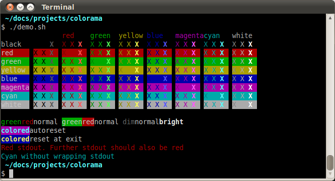
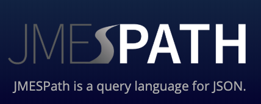
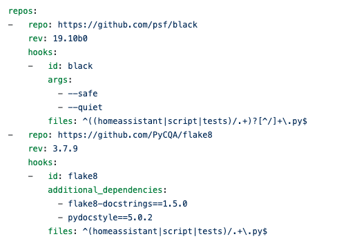
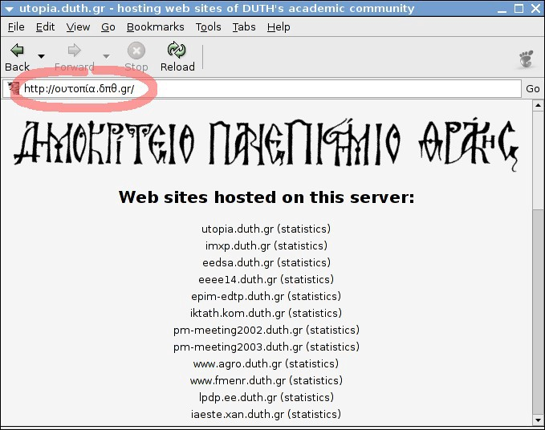
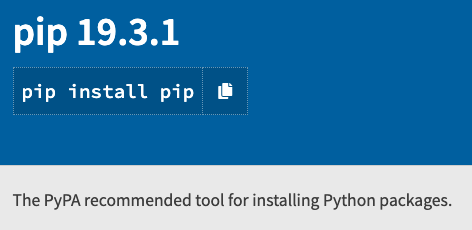

# 最后说明

很难停止编写22个软件包，因为随后的许多软件包都是像我们这样的最终用户最感兴趣的软件包。 他们将有机会在我计划的另一片作品中大放异彩！

建立此列表使我获得了以下见解：
+ 许多排名靠前的软件包都提供了某种核心功能，例如处理时间，配置文件，加密和标准化。 它们通常是其他项目的依赖项。
+ 一个常见的主题是连通性。 这些软件包中的大多数都允许您连接到服务器和服务或支持其他软件包。
+ 其余的是对Python的扩展。 创建Python包的工具，帮助创建文档的工具，创建版本之间兼容性的库等。

我希望您喜欢这份清单，并且也许从中学到了新的东西-我当然做到了！
## 30个Python最佳实践，技巧和窍门
### 提高您的Python知识和技能
# 22. Boto3

我将＃3，＃7，＃17和＃22结合在一起，因为它们是如此相关。 见＃3！
# 21. Simplejson

341M下载

需要这种高级替代方案的Python本机json模块有什么问题？ 没有！ 实际上，Python的json是simplejson。 但是simplejson具有一些优点：
+ 它适用于更多Python版本。
+ 它比Python更新的频率更高。
+ 它具有用C编写的（可选）部分，因此非常快速。

您经常会在与JSON一起使用的脚本中看到以下内容：
```
try:  import simplejson as jsonexcept ImportError:  import json
```

除非您特别需要标准库中没有的内容，否则我只会使用json。 Simplejson可以比json快很多，因为它有一些用C实现的部分。除非您正在使用成千上万的JSON文件，否则这种速度对您来说不是问题。 还要检查UltraJSON，它应该更快，因为几乎所有的内容都是用C编写的。
# 20.科罗拉多州

370M下载

使用Colorama，您可以为终端添加一些颜色：

> Screenshot by Jonathan Hartley from Colorama


为了了解这有多么容易，请看以下示例代码：
```python
from colorama import Fore, Back, Style

print(Fore.RED + 'some red text')
print(Back.GREEN + 'and with a green background')
print(Style.DIM + 'and in dim text')
print(Style.RESET_ALL)
print('back to normal now')
```
# 19.期货

389M下载

从Python 3.2开始，python提供了current.futures模块，可帮助您执行异步执行。 futures软件包是该库的后向端口，适用于Python2。它并不适用于Python 3用户，因为Python 3是本机提供的。

正如我之前提到的，从2020年1月1日起正式不支持Python2。当我明年再次访问本部分时，我真的希望这个软件包不会出现在前22名中。

undefined
```python
from concurrent.futures import ThreadPoolExecutor
from time import sleep
 
def return_after_5_secs(message):
  sleep(5)
  return message
 
pool = ThreadPoolExecutor(3)
 
future = pool.submit(return_after_5_secs, 
                     ("Hello world"))

print(future.done())
# False
sleep(5)
print(future.done())
# True
print(future.result())
# Hello World
```

如您所见，您可以创建线程池并提交要由这些线程之一执行的函数。 同时，您的程序将继续在主线程中运行。 这是并行执行程序的简便方法。
# 18.派兹

394M下载

与dateutils（＃5）一样，该库可帮助您处理日期和时间。 使用时区可能很困难。 幸运的是，有这样的软件包可以使它变得更容易。

我在时间和计算机方面的经验可追溯到此：始终在内部使用UTC。 仅当生成供人类读取的输出时，才转换为本地时间。

这是pytz用法的示例：
```python
from datetime import datetime
from pytz import timezone

amsterdam = timezone('Europe/Amsterdam')

ams_time = amsterdam.localize(datetime(2002, 10, 27, 6, 0, 0))
print(ams_time)
# 2002-10-27 06:00:00+01:00

# It will also know when it's Summer Time
# in Amsterdam (similar to Daylight Savings Time):
ams_time = amsterdam.localize(datetime(2002, 6, 27, 6, 0, 0))
print(ams_time)
# 2002-06-27 06:00:00+02:00
```

请查看PyPI页面以获取更多示例和文档。
# 17. Awscli

我将＃3，＃7，＃17和＃22结合在一起，因为它们是如此相关。 见＃3！
# 16. Setuptools

401M下载

Setuptools是用于创建Python软件包的工具。

该项目记录不良。 它没有描述它的含义，并且在其描述中包含无效链接。 最好的信息来源是以下站点：https://packaging.python.org/，特别是创建Python包的指南：https://packaging.python.org/tutorials/packaging-projects/。
# 15. Jmespath

下载4.73亿

在Python中使用JSON非常容易，因为JSON在Python字典上的映射非常好。 对我来说，这是它最好的功能之一。

> Screenshot by author


我在这里说老实话-尽管我已经使用JSON进行过很多工作，但我从未听说过该软件包。 我只使用json.loads（）并从字典中手动获取数据，也许在这里和那里都有一个循环。

JMESPath，发音为“ James path”，使Python中的JSON更加容易。 它允许您声明性地指定如何从JSON文档中提取元素。 以下是一些基本示例，可以使您对它可以做什么有所了解：
```python
import jmespath

# Get a specific element
d = {"foo": {"bar": "baz"}}
print(jmespath.search('foo.bar', d))
# baz

# Using a wildcard to get all names
d = {"foo": {"bar": [{"name": "one"}, {"name": "two"}]}}
print(jmespath.search('foo.bar[*].name', d))
# [“one”, “two”]
```

这只是触及所有可能性的表面。 有关更多信息，请参见文档和PyPI页面。
# 12. Docutils

508M下载

Docutils是一个模块化系统，用于将纯文本文档处理为有用的格式，例如HTML，XML和LaTeX。 Docutils能够读取reStructuredText格式的纯文本文档-类似于MarkDown的易于阅读的标记语法。

您可能听说过PEP文档，甚至阅读过。 那么什么是PEP文档？ 最早的PEP文件PEP-1为我们很好地说明了这一点：

PEP代表Python增强提案。 PEP是一个设计文档，向Python社区提供信息，或描述Python或其过程或环境的新功能。 PEP应该提供该功能的简明技术规范以及该功能的原理。

PEP文档使用固定的reStructuredText模板编写，并使用docutils转换为格式正确的文档。

Docutils也是Sphinx的核心。 Sphinx用于创建文档项目。 如果Docutils是一台机器，则Sphinx是工厂。 它最初是为了构建Python文档而创建的，但是许多其他项目使用它来记录其代码。

您可能已经阅读了readthedocs.org上的文档，对吗？ 那里的大多数文档都是由Sphinx和docutils创建的。
# 13. Chardet

501M下载

您可以使用chardet模块来检测文件或数据流的字符集。 例如，当分析大量随机文本时，这很有用。 但是，当您不知道字符集是什么时，也可以在处理远程下载的数据时使用它。

undefined
```
chardetect somefile.txtsomefile.txt: ascii with confidence 1.0
```

undefined

Chardet是请求和许多其他程序包的要求。 我认为没有很多人独自使用chardet，因此chardet的流行必须来自于这些依赖性。
# 14. RSA

492M下载

rsa软件包是纯Python RSA实现。 它支持：
+ 加密和解密
+ 签名和验证签名，
+ 根据PKCS＃1 1.5版生成密钥。

它既可以用作Python库，也可以在命令行中使用。

一些事实：
+ RSA中的字母是Ron Rivest，Adi Shamir和Leonard Adleman姓的首字母。 他们在1977年描述了该算法。
+ RSA是最早的公钥密码系统之一，被广泛用于安全数据传输。 在这样的密码系统中，有两个密钥：公共部分和私有部分。 您使用公共密钥加密数据，然后只能使用私有密钥解密数据。
+ RSA是一种缓慢的算法。 它很少用于直接加密用户数据。 通常，RSA用于安全地传递对称密钥加密的共享密钥，这在加密和解密大量数据时要快得多。

以下代码段显示了如何在非常简单的用例中使用RSA：
```python
import rsa

# Bob creates a key pair:
(bob_pub, bob_priv) = rsa.newkeys(512)

# Alice ecnrypts a message for Bob
# with his public key
crypto = rsa.encrypt('hello Bob!', bob_pub)

# When Bob gets the message, he
# decrypts it with his private key:
message = rsa.decrypt(crypto, bob_priv)
print(message.decode('utf8'))
# hello Bob!
```

假设鲍勃将他的私钥保密，那么爱丽丝可以确定他是唯一可以阅读该消息的人。

但是，Bob不能确定是爱丽丝发送了该消息，因为任何人都可以获取并使用他的公共密钥。 为了证明是她，爱丽丝可以用她的私钥在邮件上签名。 鲍勃可以用她的公钥验证此签名，确保它确实是她发送的消息。

诸如google-auth（＃37），oauthlib（＃54），awscli（＃17）之类的软件包取决于rsa软件包。 很少有人会将此工具用作独立工具，因为有更快，更本地化的替代方法。
# 11. Pyasn1

512M下载

像上面的IDNA一样，该项目也具有以下超级有用的描述之一：

ASN.1类型和DER / BER / CER编解码器（X.208）的纯Python实现。

幸运的是，在这个已有数十年历史的标准中可以找到很多信息。 ASN.1是“抽象语法表示法一”的缩写，就像数据序列化的教父一样。 它来自电信界。 也许您知道协议缓冲区或Apache Thrift？ 从字面上看，这是1984年的版本。

ASN.1描述了系统之间的跨平台接口以及可以通过该接口发送的数据结构。

还记得Certifi（请参阅＃8）吗？ ASN.1用于定义HTTPS协议和许多其他密码系统中使用的证书格式。 它也用于SNMP，LDAP，Kerberos，UMTS，LTE和VOIP协议。

这是一个非常复杂的规范，并且已经证明某些实施存在漏洞。 您可能还喜欢关于ASN.1的这个有趣的Reddit线程。

我建议远离，除非您真的需要。 但是，由于它在很多地方都使用过，因此许多软件包都依赖于此软件包。
# 10. PyYAML

525M下载

YAML是一种数据序列化格式。 它是为人和计算机的可读性而设计的，它对人类来说很容易读写，但计算机仍然可以对其进行解析。

> Example of YAML, image by author


PyYAML是Python的YAML解析器和发射器，这意味着它可以读写YAML。 它将把任何Python对象写入YAML：列表，字典，甚至是类实例。

Python提供了自己的配置解析器，但是与Python的ConfigParser的基本.ini文件结构相比，YAML提供了更多功能。

例如，YAML可以存储任何数据类型：布尔值，列表，浮点数等等。 ConfigParser会将所有内容存储为内部字符串。 如果要使用ConfigParser加载整数，则需要指定要明确获取int的类型：

config.getint（“ section”，“ my_int”）

虽然pyyaml自动识别类型，所以这将使用PyYAML返回您的int：

config [“ section”] [“ my_int”]

YAML还允许任意的深树，不是每个项目都需要的东西，但是它可以派上用场。

由您决定自己喜欢什么，但是许多项目使用YAML作为配置文件，因此该项目的受欢迎程度。

链接：PyYAML PyPI页面，文档。
# 9. Idna

527M下载

根据PyPI页面，idna提供了“对RFC 5891中指定的应用程序中国际化域名（IDNA）协议的支持。”

如果您像我一样，您仍然不知道Idna是什么或做什么！ 幸运的是，您的确发现了它的艰巨工作！

应用程序中的国际化域名（IDNA）是一种用于处理包含非ASCII字符的域名的机制。 但是原始域名系统已经提供了对基于非ASCII域名的支持。 所以有什么问题？

> By Adamantios — Own work, CC BY-SA 3.0, https://commons.wikimedia.org/w/index.php?curid=1630902


问题是应用程序（例如电子邮件客户端和Web浏览器）不支持非ASCII字符。 更具体地说，电子邮件和HTTP协议不支持这些字符。

对于许多国家来说，这很好，但是对于中国，俄罗斯，德国，希腊，印度尼西亚等国家来说是个问题。因此，并非偶然地，来自这些国家的一群聪明人想到了IDNA。

IDNA的核心是两个功能：ToASCII和ToUnicode。 ToASCII会将国际Unicode域转换为ASCII字符串。 ToUnicode将逆转该过程。 在IDNA软件包中，这些函数称为idna.encode（）和idna.decode（），如以下代码片段所示：
```python
import idna
idna.encode('ドメイン.テスト')
# b'xn--eckwd4c7c.xn--zckzah'
print(idna.decode('xn--eckwd4c7c.xn--zckzah'))
# ドメイン.テスト
```

如果您是受虐狂，则可以阅读RFC-3490了解此编码的详细信息。

链接：Idna PyPI页面，GitHub页面
# 8.认证

552M下载

近年来，几乎所有网站都转向了SSL，您可以通过地址栏中的小锁符号来识别它。 这意味着与该站点的通信是安全和加密的，从而防止了窃听。

> The little lock, telling us this site is secured with SSL. Image by author.


加密基于SSL证书，这些SSL证书由受信任的公司或LetsEncrypt等非营利组织创建。 这些组织使用其（中间）证书对证书进行数字签名。

通过使用这些证书的公共可用部分，您的浏览器可以验证其签名，因此可以确保您正在查看真实的东西，并且没有人窥探到数据。

Python软件可以完全相同。 这就是证明的来源。 与Chrome，Firefox和Edge等网络浏览器随附的根证书集合没有太大不同。

Certifi是根证书的精选集合，因此您的Python代码将能够验证SSL证书的可信度。

如此处所示，许多项目信任并依赖认证。 这也是该项目排名如此之高的原因。

链接：certifi PyPI页面，文档，certifi.io
# 7. S3transfer

我将＃3，＃7，＃17和＃22结合在一起，因为它们是如此相关。 见＃3！
# 6.要求

6.11亿下载

请求建立在我们的＃1库urllib3上。 它使Web请求变得非常简单。 与urllib3相比，许多人更喜欢它，而且最终用户可能会比urllib3使用它更多。 后者是较低级别的，并且由于对内部控件的控制级别，通常是其他项目的依赖项。

只是为了说明请求有多简单：
```python
import requests

r = requests.get('https://api.github.com/user', auth=('user', 'pass'))
r.status_code
# 200
r.headers['content-type']
# 'application/json; charset=utf8'
r.encoding
# 'utf-8'
r.text
# u'{"type":"User"...'
r.json()
# {u'disk_usage': 368627, u'private_gists': 484, ...}
```

链接：
+ PyPI页面
+ 文献资料
# 5. Python-dateutil

6.17亿下载

python-dateutil模块提供了对标准datetime模块的强大扩展。 我的经验是，常规Python日期时间功能在哪里结束，而python-dateutil就出现了。

您可以使用此库做很多很棒的事情。 我将这些示例限制为我发现特别有用的示例：模糊分析日志文件中的日期，例如：
```python
from dateutil.parser import parse

logline = 'INFO 2020-01-01T00:00:01 Happy new year, human.'
timestamp = parse(log_line, fuzzy=True)
print(timestamp)
# 2020-01-01 00:00:01
```
# 4.点

627M下载

> PyPI Screenshot by author


我想你们大多数人都知道并且喜欢pip，它是Python的软件包安装程序。 您可以使用pip轻松地从Python软件包索引和其他索引安装软件包，例如本地镜像或带有私有软件的自定义索引。

有关pip的一些有趣事实：
+ pip是“ Pip Installs软件包”的递归首字母缩写。
+ 点很容易使用。 安装软件包就像pip install <软件包名称>一样简单，而删除它是通过pip install <软件包名称>完成的。
+ 它的最大优势之一是，它还可以获取软件包列表，通常以requirements.txt文件的形式出现。 该文件可以选择包括所需版本的详细规范。 大多数Python项目都包含这样的文件。
+ 通过将pip与virtualenv（清单57）结合使用，可以创建可预测的隔离环境，而不会干扰基础系统，反之亦然。
# 3. botocore，boto3，s3transfer，awscli

我在这里对一些相关项目进行了分组：
+ botocore（＃3，6.6亿下载）
+ s3transfer（＃7，584M下载）
+ awscli（下载量为394M的＃17）
+ boto3（下载量329M排名第22）

Botocore是Amazon Web Services的低级界面。 Botocore是Boto3（＃22）库的基础，该库使您可以使用Amazon S3和Amazon EC2等服务。

Botocore还是AWS-CLI的基础，它为Amazon Web Services提供了统一的命令行界面。

S3transfer（＃7）是用于管理Amazon S3传输的Python库。 它正在大量开发中，其页面上基本上说不使用它，或者至少将版本固定下来，因为API可能会更改，即使在次要版本之间也是如此。 Boto3，AWS-CLI和许多其他项目都依赖s3transfer。

令人惊讶的是，这些特定于AWS的库的排名如此之高-这充分说明了AWS的杰出之处。

链接：
+ botocore PyPI页面和文档，
+ Boto3 PyPI页面和文档
+ awscli PyPI页面
# 2.六

732M下载

六个是Python 2和3兼容性库。 该项目旨在支持可在Python 2和3上运行的代码库。

If提供了许多可简化Python 2和3之间语法差异的函数。一个容易理解的示例是six.print_（）。 在Python 3中，打印是通过print（）函数完成的，而在Python 2中，打印可以不带括号。 因此，通过使用six.print_（），您可以使用一条语句来支持两种语言。

事实：
+ 名称“ 6”来自两个三等于六的事实。
+ 对于类似的库，也请查看将来的软件包
+ 如果要将代码转换为Python 3（并停止支持2），请查看2to3。

尽管我了解它的受欢迎程度，但我希望人们将完全放弃使用Python 2，尤其是因为从2020年1月1日起正式不支持Python 2。

链接：PyPI页面和文档。
# 1. Urllib3
## 893M下载

Urllib3是Python的HTTP客户端，带来了Python标准库中缺少的许多功能：
+ 线程安全。
+ 连接池。
+ 客户端SSL / TLS验证。
+ 使用分段编码上传文件。
+ 重试请求和处理HTTP重定向的助手。
+ 支持gzip和deflate编码。
+ HTTP和SOCKS的代理支持。

尽管名称如此，Urllib3并不是urllib2的后继者，后者是Python核心的一部分。 如果您想使用尽可能多的Python核心功能，也许是因为您限于可以安装的功能，请查看urlllib.request。

对于最终用户，我强烈推荐请求包（请参阅此列表中的＃6）。 该软件包是＃1，因为几乎有1200个软件包依赖urllib3，其中许多软件包在此列表中的排名也很高。
# 世界上22个最常用的Python软件包
## 关于如何使用Python的教育性和令人惊讶的见解

> Photo by NASA on Unsplash


Python在全球和各行各业如何使用？

这个问题启发了我写这篇文章。 我认为最常用的Python软件包列表可以很好地说明这一点。

首先，我列出了过去365天内PyPI上下载次数最多的Python软件包列表。 让我们深入研究它们的工作，它们之间的关系以及它们为何排名很高的原因！
```
(本文翻译自Erik-Jan van Baaren的文章《The 22 Most-Used Python Packages in the World》，参考：https://medium.com/better-programming/the-22-most-used-python-packages-in-the-world-7020a904b2e)
```
