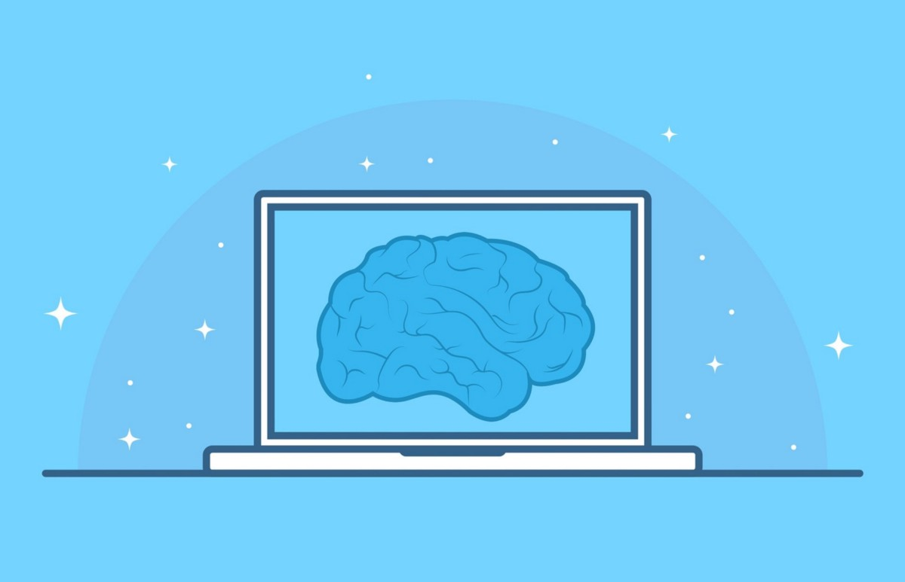
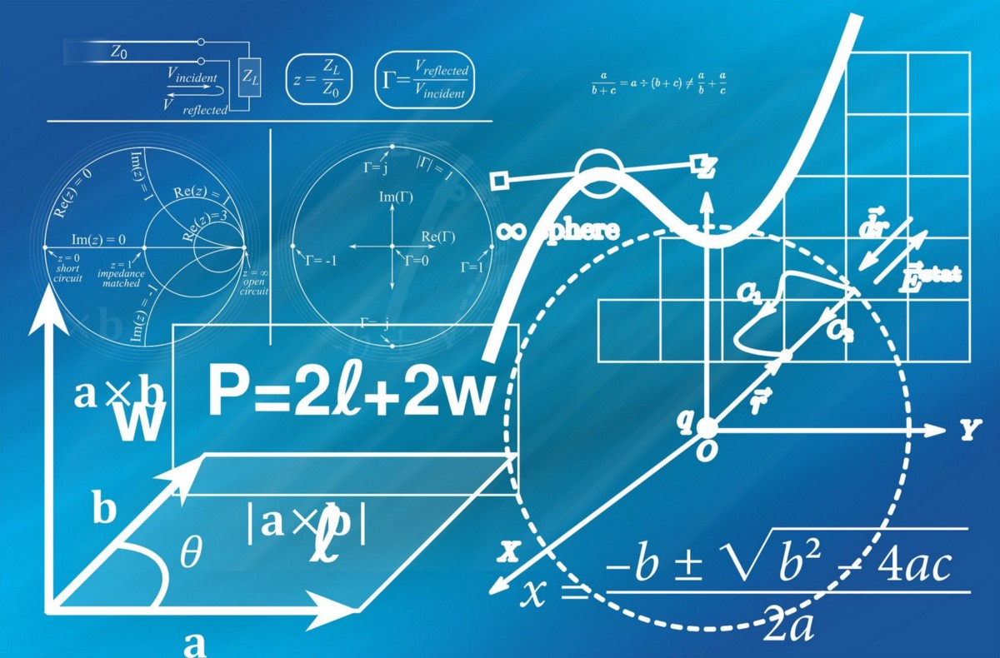
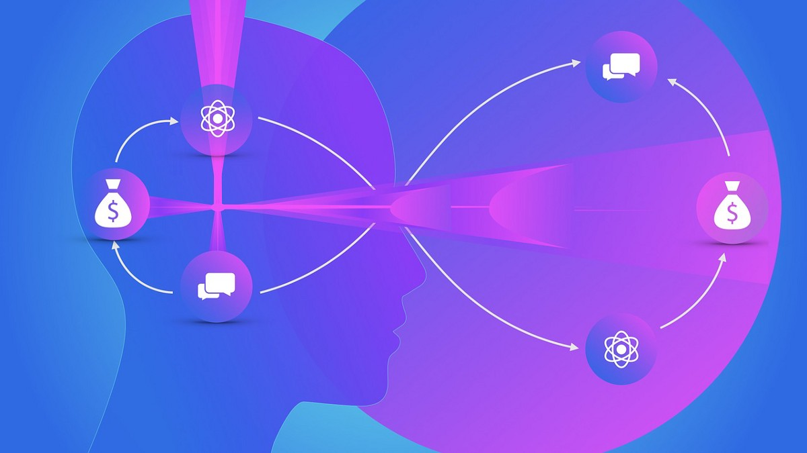
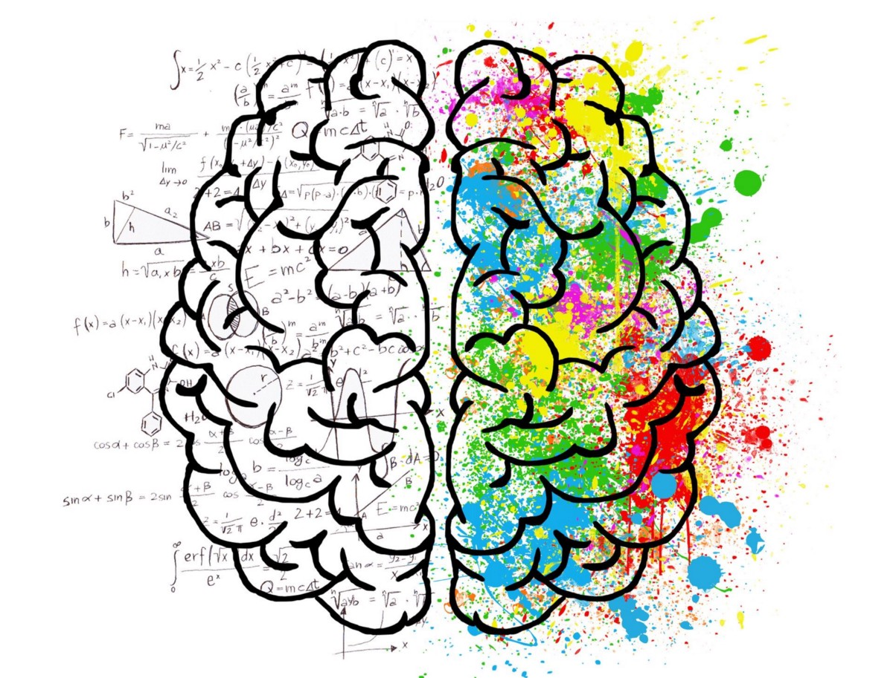

# 人工智能的未来
## 探索围绕“强大的AI”创造的四个中心论点。

> Image Source: Pixabay


2012年，Alex Krizhevsky，Ilya Sutskever和Geoffrey E. Hinton在ImageNet LSVRC2010竞赛中发布了他们的结果，这是一项计算机视觉挑战，旨在将120万个高分辨率图像自动分类为1,000个不同的类别。 他们对深度神经网络的使用大大提高了错误率，标志着最近对机器学习和人工智能的关注开始了。

在随后的几年中，深度学习已应用于许多其他问题，并在诸如数字助理的语音识别，翻译软件和自动驾驶汽车等应用中得到了有成果的使用。 但是尽管有所有这些令人印象深刻的成功故事，深度学习仍然受到严重限制。

一方面，训练网络需要大量的标记数据。 在人类儿童可能只通过看几个例子就学会识别动物物种或一类物体的情况下，深度神经网络通常需要成千上万张图像才能达到类似的精度。

另一方面，当今的算法还远没有像人类那样实现类或实体的本质。 许多例子表明，即使对于最新的神经网络，在对人类来说微不足道的情况下，其故障也会急剧恶化。

虽然神经网络在当今很流行，但它们的概念基础还是相当古老的。 根据当时的理解，在1950年代和1960年代，受到大脑解剖结构的启发，已经对它们进行了深入研究。

当今的深层神经网络除了具有更高的层数外，基本上与那些经典网络相同。 他们近年来的成功很大程度上归功于计算能力的提高和大量培训数据的可用性。

驱动当前研究策略的一个中心假设是，新一代算法只能克服AI的当前局限性。 这些算法将受到当今神经科学的启发，并在某种程度上受到我们对大脑的了解的发展所启发。
## 人工智能的未来

情报虽然是一个广泛而全面的概念，但也臭名昭著。 在对智力的可用定义进行的全面调查中，Legg和Hutter列出并回顾了70多种不同的概念。 提取最常见的功能后，它们对智能的定义如下：

情报可衡量代理在多种环境中实现目标的能力。

掌握什么是直接的智能的困难会延续到在机器中进行仿真的尝试。 人工智能一词已经存在了数十年，并且根据当时的技术进步，它具有截然不同的含义。

大型软件公司的营销部门出于自己的目的使用了AI一词，这也无助于提高清晰度。 如果我们严格应用Legg和Hutter的定义，那么今天就不存在人工智能。 当今，没有任何一种计算机程序可以在与人类操作环境相当的一系列环境中实现目标。

另一方面，算法可以在（超）人的水平上执行某些定义明确的认知任务，例如玩计算机游戏或识别图像中的狗的种族。 因此，AI界区分了窄AI和强AI。

与以上定义相似，我们可以将Narrow AI定义为代理在（非常）有限的环境范围内实现目标的能力。 通常认为，这种Narrow AI的性能将与人类的性能相同或更好。 从自动驾驶汽车到AlphaGo击败围棋冠军Lee Sedol，当前所有AI突破都是Narrow AI的例子。 强大的AI（也称为通用AI或人工通用人工智能（AGI））将是一个符合Legg和Hutter上面定义的系统，即它将在多种环境中实现目标。

同样，通常假定这样做的话，代理人至少会和普通人一样成功。 尤其是，这样的强大AI将通过欺骗在线聊天中的人类对话伙伴（并考虑到语音合成的最新进展，当然也包括电话），通过了著名的图灵测试，从而认为它实际上是另一个人，而不是 机器。
## 复杂性论证

> Image Source: Pixabay


“人脑是如此之复杂，以至于我们将永远（或至少不会很快）复制或模拟它。”

人类的大脑确实是神秘的，极其复杂，以至于它是迄今为止已知宇宙中最复杂的结构。 但是，至少有两个原因可能不会阻止我们成功构建强大的AI：

undefined

它也需要与生物体能产生的能量相适应，并且仅限于那些对聪明程度较低的动物而言恰巧产生了“生物技术”（即神经细胞）的变异。

另一方面，出于我们开发强大AI的目的，可以放弃所有这些要求。 我们不需要模拟一个完整的人-复制提供其智能的核心算法就足够了。

想想下面的类比可以更清楚地说明这一点：在空气动力学发明之前，人们就对鸟类的飞行能力进行了研究和赞赏。 解剖学分析表明，鸟（甚至仅是其翅膀）是由骨头，肌肉，动脉，羽毛等组成的极其复杂的“机器”，并且没有希望将鸟的翅膀复制到最细的状态。 每根羽毛的结构细节。 但是，一旦您了解了空气动力学的基本原理，您就会发现，只有几个非常简单的因素对鸟的飞行至关重要：其身体的几何形状（尤其是机翼），重量以及相对于周围空气的相对速度 。

一旦了解了基本概念，便可以轻松建造一架飞机，事实证明，大多数鸟类特有的复杂性（如拍打的机翼或结构精细的羽毛）都可以愉快地掉落。

还有第二个理由认为，与大脑的复杂性相比，智力的出现相对简单：新皮层是执行认知任务的大脑区域，例如识别图像，理解口语，控制身体运动， 或一般的思考。 已经提出，新皮层中到处基本上只有一个“算法”可以高度并行地完成所有这些不同而困难的任务。

一种新皮层算法的想法可以追溯到Mountcastle，并已被Jeff Hawkins，Ray Kurzweil和其他人采用并普及。 这是一个令人鼓舞的带回家的信息：如果您了解一小块新皮层组织的功能，那么您可能已经了解了智能的本质。

支持Mountcastle想法的两个重要论点是整个新皮层的微观组织结构的均匀性及其可塑性-即，一个新皮层组织可以根据接收到的输入信号的类型来接管非常不同的任务这一事实。 例如，Marina Bedny等。 表明，先天盲人的视觉皮层可以接管语言处理的任务。 Daniel Feldmann撰写的评论概述了新皮层可塑性现象。
## 计算论点

> Image Source: Pixabay


“我们根本没有足够的计算能力来构建强大的AI。”

只要我们不了解算法的工作原理，就很难估计何时才能拥有足够的计算能力来构建强大的AI。 上面的鸟类比表明，使用一种比完全模拟整个大脑复杂得多的算法可以实现强大的AI。 甚至即使今天的计算能力也足够了。

但是，即使不是这样，在摩尔定律继续成立的假设下，人们也可以估计，在未来几十年内，可用的计算能力将接近大脑。
## C字争论

> Image Source: Pixabay


“因为X，所以您无法构建自我意识的机器”（其中X是任意的哲学或宗教陈述）。

由于只有人类才具有意识或灵魂，出于同样的原因，所有这样的论点都只有人类才可以是“真正的智者”：他们无法将主观形而上学的水平与系统的客观可观察到的行为区分开来。

即使人类碰巧同时具有意识和智慧，也没有理由相信两者需要因果联系。 您可能已经完全潜意识地做出了许多明智的决定，相反，即使您躺在床上而没有做任何事情或认为任何明智的事情，您也意识到了自己。

当谈到强AI时，我们并不意味着这样的系统会变得自觉（尽管我们也不会排除它），而且就技术可行性而言，这个问题是完全不相关的。
## 创意论点

> Image Source: Pixabay


“只有人类才能创造新事物，进行研究或表演艺术。”

实际上，这更是对当前的观察，而不是对未来可能或不可能的争论。 实际上，即使只是观察当前的状况，该声明也不再完全准确，例如AlphaGo Zero的示例-它自学了玩围棋，发明了新的动作和策略，包括一些以前未知的 人类-表演。

由于上述原因，我支持强AI原则上可行，并且我们即将拥有足够的计算能力来实现它（或者也许我们已经拥有）的观点。 似乎，找到正确的算法（受人脑启发但不能过于复制）是实现此目标的关键。

以下是在实现强大AI的过程中可能产生的中间结果的一些示例：

•具有最少训练数据的计算机视觉：尽管深层神经网络在某些图像识别任务中达到了人类水平的准确性，但是对大型训练数据集的需求仍然使许多用例在技术上或经济上都不可行。 特别是在系统需要学习大量边缘情况（例如自动驾驶汽车）或训练数据的可用性受到限制（例如在某些医疗诊断方案中）的情况下。

•自然语言处理：计算机仍然很难形成对非结构化文本数据的理解。 最近，朝着这个方向迈出了令人印象深刻的步骤，例如Google的BERT，它使用带有双向网络的无监督表示学习来进行自然语言处理中的转移学习。

•准确的动作识别：训练算法以识别视频序列中执行的动作仍然是很大的挑战。 动作识别方面的进展可能会解锁与经济相关的用例，例如在安全监视或人机交互中。

•运动控制：尽管机器人技术和运动控制取得了令人瞩目的进步，但即使是简单的动物也可以控制运动控制系统，该系统比现代机器人更加灵活，自适应，健壮和通用。 例如，对机器人进行编程以拾取各种各样的物体（具有不同的大小，重量，形状和稳定性）仍然是一项艰巨的任务。 寻找能够模仿生物运动控制的算法可以极大地扩展机器人技术的用例范围（例如，在工业，物流或家庭应用中），同时降低其开发成本。

•内容生成：今天的Narrow AI已经能够创作音乐（例如，由初创公司AIVA进行商品化）或生成人脸图像。 但是，当今大多数内容生成算法都在训练有素的空间中运行。 我们看到使用强化学习的第一种方法在训练数据的范围之外具有创造力，这只会在迈向强大的AI的道路上有所改善。 似乎某个时候，大多数内容-从音乐，文字和视频到新的化学结构和活性药物成分-都可以由AI创造。

如导言所述，当今的深度学习大致基于大约60年前的神经科学概念。 纵观当前算法和应用程序的爆炸式增长，可以肯定地说这一灵感是成功的。

同时，科学家还产生了有关大脑的大量其他信息。 这些知识是否可以帮助我们设计下一代AI算法？ 一个严重的困难是我们对大脑基本工作原理的理解仍然有限。 如何显示它们？

跟我来了解AI，机器学习和数据科学领域的最新消息。
```
(本文翻译自Marcel Deer的文章《The Future of Artificial Intelligence》，参考：https://towardsdatascience.com/the-future-of-artificial-intelligence-89a4d66eafbd)
```
