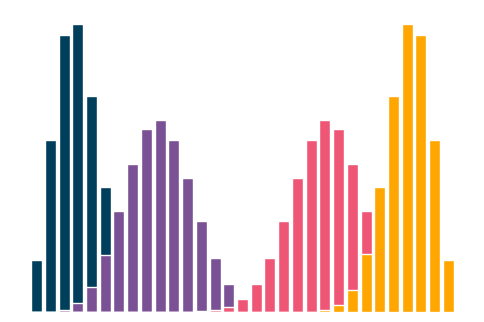
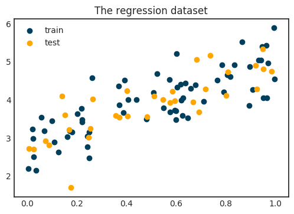
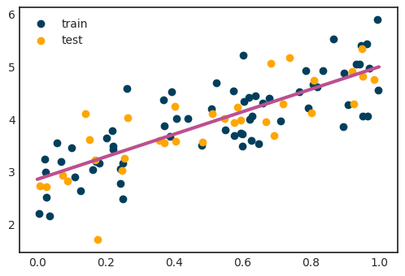
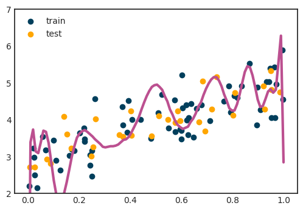
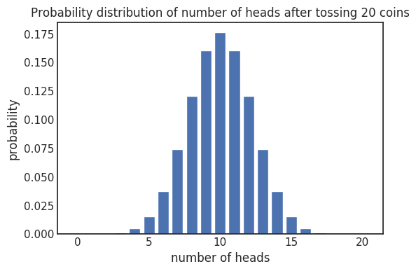
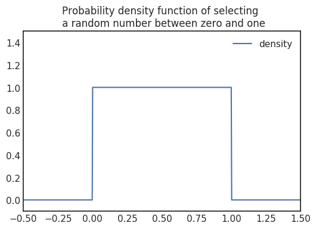
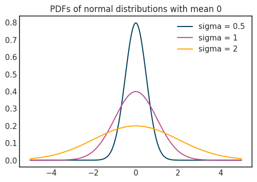
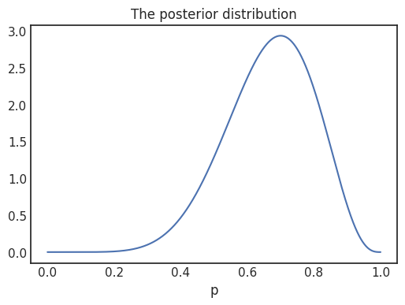
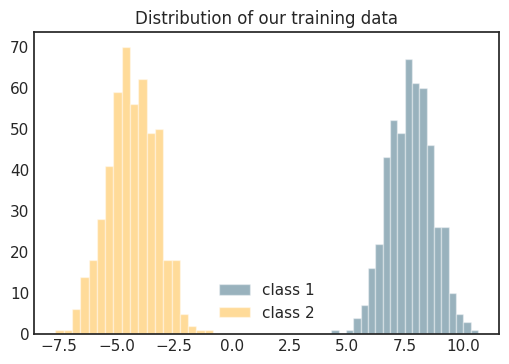

# 机器学习的统计基础
## 超越功能的外观

undefined

我的目的是证明当我们拥有适当的视角时，如何用真正简单自然的想法来解释机器学习中看似模糊的和即席的方法。 为此，我们的数学工具将是概率理论和统计学，这是预测模型的基础。 使用概率理论不仅是一项学术活动，它实际上还可以提供对机器学习原理的非常深刻的见解，从而为您提供了改进现有技术的工具。

在开始学习机器学习的理论基础之前，让我们来看一个玩具问题！
# 拟合模型

假设我们有两个相互关联的数值，例如x和y。 例如，x是房地产的平方英尺，y是给定城市在市场上的价格。 我们的目标是从x预测y。 用数学术语来说，我们可以说我们正在寻找一个函数f（x）使得


undefined

我们的示例数据集如下所示。


假设我们的数据集由数据点和观测值组成


由于数据嘈杂，因此不可能将线性模型拟合到我们的数据中


持有。 取而代之的是，我们测量特定模型对数据的拟合程度，并尝试根据该度量找到最佳拟合。

通常，这是通过计算每个点的预测误差，然后平均逐点误差来完成的。 误差越小，我们的模型越好。 衡量这一点的最简单方法是对预测值与基本事实之间的差异求平方。 这称为均方误差，其定义为


最佳拟合是指均方误差取其最小值，或者用数学术语表示，


对于我们的具体数据集，如下所示。

> A fitted regression model


对于我们的目的，如何最小化它并不是特别重要。 对我们而言重要的是如何解释模型以及传达什么样的信息。 简单地看一下，就可以知道有很多遗漏的东西。 当然，数据显然遵循线性趋势，但是甚至可以用我们的模型来描述吗？ 函数是确定性的：插入x，即可得到预测f（x）。 但是，数据似乎显示出一些噪声，显然我们的线性模型无法正确捕获这些噪声。

我们还能在哪里看？ 一个明显的答案是寻找一个更复杂的函数，例如一个更高次的多项式。 用数学术语来说，我们正在寻找一个由


希望可以更精确地描述数据。 不幸的是，这种情况并非如此。

> Fitting a polynomial of degree 30 to our training data


当我们尝试强行使用它并过分提高模型的表达能力时，我们会发现，从某种意义上讲，情况甚至更糟：我们的关切没有得到解决，并且引入了其他问题，例如模型在我们领域之外的疯狂行为 。 我们必须在其他方向寻找解决方案。 代替寻找单个值作为预测，我们应该针对一个模型来解释某些结果的可能性！ 这样，我们可以做出更明智的决策，例如计算风险。
# 概率论的语言

假设我有一个硬币，投掷硬币时有1/2的正面出现概率和1/2的背面出现概率。 如果我抛硬币100次，我会得到多少个头？ 快速回答50可能很吸引人，但事实并非如此简单。 可以看到，您可以从0到100任意数量的磁头，但是这些磁头的可能性不相等。 在一个实验中，您可能会得到34，在接下来的实验中，您可能会得到52，依此类推。正头的概率为1/2，这意味着如果您无限地掷硬币，则正头与所有抛掷的比例将越来越接近1 / 2。

让我们以扔硬币n次为例！ 假设X表示头数。 X是一个随机变量，我们不知道确切的值，只是未知的它会取给定值的概率。 X为k的概率由P（X = k）表示，该值始终为0到1之间的数字。此外，由于我们知道可以得到0、1、2等，直到n个头， 这些概率总计为1，即


每个实验都可以用H-s和T-s的n个长序列来描述。 为了计算给定k的确切概率，我们需要计算n次抛掷中可以有多少种方法。 从数学上讲，这等效于从一组n个元素中选择k个元素的子集，这可以在


方法。 此外，每个配置具有（1/2）^ n个概率。 （例如，考虑n =3。配置HTH的概率为1/8，因为每个特定的抛掷本身具有1/2概率，并且抛掷是独立的。）因此，将其放在一起


这些数字加在一起称为实验的概率分布。 （正在抛n个硬币并观察其中的头数。）

总而言之，概率分布包含有关实验结果的所有信息。 上一节中的模型仅给我们一个数字，但是，我们应该寻找概率分布，而不是做出完全明智的决定。
## 一般伯努利分布和二项分布

上面的两个例子可以概括。 首先，假设我们扔了一个不公平的硬币，即，正面和反面的概率不相等的硬币。 假设正面的概率为p，并表示X的正面数与以前一样。 （可以为零或一。）


称为参数为p的伯努利分布，或简称为伯努利（p）。 按照这种思路，如果我们抛弃这个不公平的硬币n次，


这就是参数n和p或简称b（n，p）的二项式分布。 请注意，伯努利分布只是n = 1的二项式分布。

## 连续概率分布

在前面的抛硬币示例中，概率分布由所有可行k的数字P（X = k）完整描述。 这个特定的随机变量只能采用整数作为其值，其中有许多是整数。 这种随机变量称为离散变量。 但是，在前面的案例中，我们估计房地产价格会如何呢？ 通常，随机变量还可以假设所有实数作为其值。 在这种情况下，它们被称为连续的。 说X可以是介于0到1之间且具有相等概率的任意随机数。 它的概率分布是多少？ 凭直觉，我们可以看到


对于[0，1]中的任何固定x。 那么，我们将如何描述这种分布？ 我们使用所谓的概率密度函数（简称PDF）来描述X落入某个范围的概率，例如a≤x≤b。 概率本身可以通过测量a和b之间的PDF曲线下的面积来计算。 在选择一个介于零和一之间的随机数的情况下，


用于密度函数。 请注意，密度函数图下的总面积始终为1，因为它表示所有结果的概率。

## 正态分布

连续分布非常重要，就是所谓的正态分布。 （或者用高斯命名）。即使您可能还不知道这是正态分布，也确实在某个时候遇到过。 我们说X的正态分布为均值μ和方差σ²方差，如果其密度函数为


这在现实生活中经常出现，例如人的身高倾向于显示这种分布。 我们在旅途中将会遇到很多次。 平均值描述了钟形曲线的中心。

从符号上来说，N（μ，σ²）的PDF通常表示为N（x |μ，σ²）。 我们将在以后使用。

## 条件概率

undefined


undefined

这个概念可以用数学形式化为条件概率。 假设您有两个事件，A和B。在我们的具体示例中，A是抛出的结果小于或等于3，而B是抛出的结果是偶数。 给定B发生的给定A的概率称为给定B的条件概率。用P（A | B）表示，可以计算为


在我们的情况下，P（A和B）= 1/6，而P（B）= 1/2，所以我们获胜的机会是P（A | B）= 1/3。
## 机器学习的统计基础

要了解条件概率如何适合我们的机器学习视角，我们需要采取另一种概念上的跳跃。 让我们再次回顾一下掷硬币的例子！ 但是，这次硬币不公平，因此正面出现的可能性不是1/2。 假设


对于[0，1]中的一些p。 渔获物是，我们不知道它的确切价值，我们必须从数据中猜测。 换句话说，我们要估计其概率分布。 p是抛硬币实验中的参数。 （请注意，这里有两种分布：一种描述抛硬币的结果，第二种描述我们对给定硬币正面朝上的概率的信念。）

假设我们手中有特定的硬币，然后将它抛向空中十次，得到结果


也就是三尾七头。 用概率的语言，E描述事件“十分之七”。 所以，我们真正想要的是


之所以称为后验，是因为它描述了我们观察到一些数据后对硬币的信念。 请注意，这是一个连续的概率分布，因为p可以假设介于0和1之间的任何值。 我们将如何计算呢？ 条件概率的基本属性在这里可以解决。 如果A和B是一般事件，则


换句话说，以B为条件的A的概率可以用以A为条件的B的概率表示。这被称为贝叶斯定理，它对于概率密度函数也成立。 这对我们有什么帮助？ 现在我们有


这对我们来说很棒！ 这里有三个组成部分。

i）P（E | p），称为似然度。 它很容易计算，我们在上一节中已经做到了。 在目前的情况下，我们有七个头


这意味着它们彼此成比例，即直到乘法常数。 这个常数对我们来说并不重要，原因将在后面解释。

undefined


这已经为我们所熟悉。

iii）由于函数P（p | E）下的面积始终为1，因此不需要计算P（E）。 （在大多数情况下，计算P（E）甚至在计算上都是难解的。）由于这个确切的原因，我们实际上并不关心似然函数中的乘法常数。

从这些数据中，我们可以轻松地得出p的概率分布的良好估计，该概率描述了一次抛硬币会导致正面抛掷的概率。

> Posterior distribution for p after tossing the coin ten times, obtaining seven heads and three tails.

## 最大似然估计

即使我们具有概率分布，但通常也可以提供一个具体的数字作为我们的估计值。 在这种情况下，我们希望有一个参数来估计我们的硬币掉头的概率。 尽管贝叶斯路线易于抛硬币，但可能无法进行分析计算。 可能会问一个问题：鉴于我们观察到的结果，最有可能采用哪个参数？ 如果您考虑一下，这由似然函数来描述


其中E描述了事件HHTHTHHHHT。 我们通过将观察到的事件的概率相乘来计算得出。

一般来说，如果我们有观察


结果


为方便起见，以矢量形式编写，似然函数定义为


这是变量θ的函数。 θ表示概率分布的所有参数，因此它甚至可以是标量或向量变量。 在我们重复的抛硬币示例中，Y表示第i次抛硬币实验，y表示结果。 在这里，y表示头部为1，尾部为0。 还请记住，通常，Y可以是离散的，但也可以是连续的。

直观地（这是我们经常使用的短语：）），似然函数假定其最大值的特定θ值将是我们参数估计的合理选择。 此方法简称为最大似然估计或MLE。 用数学术语来说


在上面有七个头和三个尾的具体示例中，该值为0.7。 尽管MLE不如完整的贝叶斯治疗那样理想，但通常是合理的。 注意，当先验分布均匀时，MLE等效于通过最大化后验分布来估计参数


后者简称为最大后验估计或MAP。

掌握了所有这些数学工具之后，我们就可以回顾原始的回归示例！
## 重新回归

回顾一下，我们有观察


我们想根据x-es来预测y-s 以前，我们在寻找函数f（x）= ax + b


相当接近地面真理。

这次，从概率的角度来看！ 现在我们有了数据点


来自发行版


对于每个数据点，我们都有地面实况观察


来自发行版


可以合理假设所有Y-s都可以建模为正态分布N（μ（x），σ（x）²）。 为简单起见，我们可以假设方差是常数，并且μ（x）= ax + b是线性函数。 也就是说，我们正在寻找适合的模型


根据我们的所有观察，似然函数可以写成


我们要最大化此功能。 这似乎很困难，但是有一个标准的数学技巧：最大化一个函数与最大化其对数相同。 （只要对数正确定义，就像这里一样。）因此，我们有


我们在这里看到隧道尽头的光。 可以省略第一项（因为它是一个常数），而最小化功能与最大化其负数相同。 从而，


如果看起来很熟悉，这绝不是偶然的：右侧是均方误差！ 这表示以以下形式拟合模型的最大似然估计


是我们之前做的线性回归的一般情况。 但是，有一个主要区别：概率模型的解释远不只是简单的线性函数。 这只是冰山一角，有很多方法可以推广这种简单的概率模型，从而获得与我们的数据更为通用的拟合。 一种明显的方法是将σ作为参数，并删除常数假设。
## 分类

在结束之前，我们将详细研究分类，这是机器学习中的另一类主要问题。 在这里，我们有一个稍微不同的问题。 我们的训练数据又来了


这次，y-s是标签而不是实数。 因此，Y是离散的概率分布。 我们之前的线性回归模型无法正确捕获此问题。 此外，尽管在将标签编码为整数时可以使用均方误差，但这实际上没有任何意义。

为了说明起见，让我们考虑一维简单的二进制分类问题，该问题具有两个类别，分别用0和1编码。


如果您熟悉这些类型的问题，则您可能知道通常的解决方案是使表格的功能适合


哪里


是众所周知的S型函数。 该模型称为逻辑回归。 启发式地，拟合线性函数，以使其对于属于第一类的x-es假定正值，而对于相反的类假设其值为负值。 然后，S形将这些实数转换为概率。 ax + b越高，其S形值越接近1，类似地，ax + b越低，其S形值越接近0。因此，f（x）有效地模拟了x属于1类的概率。 。

为了拟合该模型，最小化了所谓的交叉熵损失，其定义为


这个损失函数是什么意思？ 在最开始的回归示例中，均方误差在直观上很明显。 交叉熵不是这种情况。 您是否曾经想过为什么以这种方式定义交叉熵损失？ 仅看这个公式，几乎是不可能的。

如果我们从前面几节中获得的观点来看分类问题，则可以通过对每个x拟合伯努利分布来解决该二元分类问题，也就是说，我们使用


对于似然函数，我们有


在像以前一样取对数之后，我们得到


这是交叉熵损失的负面影响！ 突然之间，这个充满对数的神秘公式有了一个清晰的解释。 最小化交叉熵损失只是使用伯努利分布对我们的数据建模，并采用最大似然估计。
# 摘要

当使用机器学习算法来解决诸如分类和回归之类的问题时，我们通常以口头语言提出问题，例如“明天该股票的价格是多少？”，“这是负面还是正面的评论？”等等。 在这里，我的目的是表明这些算法中的许多实际上正在做的更多：它们提供了对潜在问题的深刻统计理解。 他们有能力提供比简单的预测更多的信息，而不是简单地估计明天的股价。 我们已经看到，机器学习的基本对象（例如线性回归，具有逻辑回归的二元分类，均方误差和交叉熵损失）都来自统计环境中非常自然的思想。

这只是冰山一角。 尽管我们只看到了最基本的模型，但即使是最先进的深度神经网络也都建立在这些基础之上。 如果您了解了这些基础知识，那么您现在距离掌握机器学习又迈了一大步。
```
(本文翻译自Tivadar Danka的文章《The statistical foundations of machine learning》，参考：https://towardsdatascience.com/the-statistical-foundations-of-machine-learning-973c356a95f)
```
