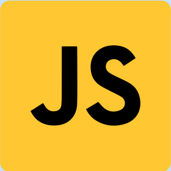
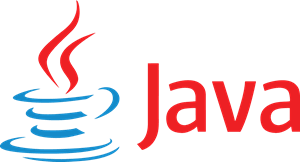
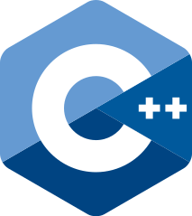

# 1. Python


当Guido van Rossum在1990年代开发Python作为他的副项目时，没有人认为这是有一天最流行的编程语言。 考虑到所有公认的排名和行业趋势，我将Python视为整体上排名第一的编程语言。

Python尚未像Java或C / C那样迅速普及。 而且，Python并不是一种破坏性的编程语言。 但是从一开始，Python就专注于开发人员的经验，并试图降低编程的障碍，以便学童也可以编写生产级代码。

在2008年，Python进行了大修和改进，以引入Python 3引入重大突破性变化为代价。

如今，Python无处不在，并已用于软件开发的许多领域，并且丝毫没有放缓的迹象。

3个主要功能：
+ Python的USP是其语言设计。 它是高效的，优雅的，简单的但功能强大的。 Python已在开发人员经验和深受影响的现代语言（如Go，Julia）方面树立了黄金标准。
+ Python与C / C具有一流的集成，可以无缝地将CPU繁重的任务卸载到C / C中。 此外，Python还为NumPy，Pandas，SciPy，Scikit-Learn等各种库提供了强大的数学，统计和计算科学工具集。 因此，Python主导了机器学习/深度学习/数据科学领域和其他科学领域。
+ Python具有非常活跃的社区和支持。 无论您从事的是企业应用程序，数据科学还是人工智能，您始终可以找到足够的Python库和框架。

人气：

在过去的几年中，Python的需求出现了巨大的增长，并且没有放缓的迹象。 编程语言排名网站PYPL将Python评为排名第一的编程语言，在2019年获得了可观的普及度：

> Source: PYPL


此外，根据GitHub存储库的贡献，Python已超越Java，成为第二大最受欢迎的语言：

> Source: Octoverse


此外，StackOverflow开发人员调查将Python列为第二受欢迎的编程语言（第四受欢迎的技术）：

> Source: StackOverflow Developer Survey, 2019


另一个编程语言排名网站TIOBE在去年将Python排名第三，并获得了可观的增长：

> Source: TIOBE


undefined

> Source: Octoverse


StackOverflow开发人员调查将Python列为第二受欢迎的编程语言：

> Source: StackOverflow Developer Survey, 2019


大多数较旧的主流编程语言都具有稳定或下降的吸引力。 此外，Python在这里是个例外，并且在最近五年中呈上升趋势，从Google趋势可以明显看出：

> Source: Google Trends


人才市场：

根据Indeed的说法，Python是美国就业市场上要求最严格的编程语言，在2020年1月发布的最高职位为74K。Python的年薪为12万美元，排名第三。

> Source: Indeed


此外，StackOverflow开发人员调查还显示，与其他主流编程语言相比，Python开发人员的薪水较高，但经验相对较低：

> Source: StackOverflow Developer Survey, 2019


主要用例：
+ 数据科学
+ 数据分析
+ 人工智能，深度学习
+ 企业应用
+ Web开发
# 2. JavaScript


在第一次浏览器大战中，Netscape指派了Brendan Eich为其浏览器开发一种新的编程语言。 布伦丹·艾希（Brendan Eich）仅用了十天就开发出了最初的原型，剩下的就是历史了。 由于语言设计欠佳且缺乏功能，软件开发人员常常在早期嘲笑JavaScript。

多年来，JavaScript已发展成为一种多范例，高级，动态编程语言。 JavaScript的第一个重大突破是在2009年，当时Ryan Dahl发布了跨平台JavaScript运行时Node.js，并使JavaScript可以在服务器端运行。

JavaScript的另一项重大突破出现在2010年左右，当时Google发布了基于JavaScript的Web开发框架AngularJS。

如今，JavaScript是世界上使用最广泛的编程语言之一，几乎可以在任何地方运行：浏览器，服务器，移动设备，云，容器，微控制器。

3个主要功能：
+ JavaScript是浏览器编程中无可争议的王者。 如今，Web开发主要由基于JavaScript的SPA框架（例如React，Vue.js，Angular）主导。
+ 感谢Node.js，JavaScript提供了事件驱动的编程，特别适合I / O繁重的任务。 如今，JavaScript和Node.js几乎可以在所有平台上运行，包括服务器和移动设备。
+ 在过去的几年中，JavaScript经历了大规模的现代化和大修，尤其是在2015年，2016年及以后。 像ES5，ES6这样的主要JavaScript版本都增加了许多现代功能，而今天的JavaScript与过去十年的JavaScript完全不同。

人气：

JavaScript是所有平台上的普遍使用和大规模采用的最高级编程语言之一。

Octoverse在GitHub存储库贡献中连续五年将JavaScript列为编程语言的第一名：

> Source: Octoverse


此外，2019年StackOverflow开发人员调查将JavaScript列为最受欢迎的编程语言和技术：

> Source: StackOverflow Developer Survey, 2019


另一个编程语言受欢迎的站点PYPL将JavaScript排名为第三大最受欢迎的编程语言：

> Source: PYPL


编程语言流行网站TIOBE将JavaScript排名为第七大流行编程语言：

> Source: TIOBE


一旦被开发人员所畏惧，根据StackOverflow开发人员调查，JavaScript也被列为最受欢迎的11种编程语言：

> Source: StackOverflow Developer Survey, 2019


JavaScript的趋势相对稳定，如Google趋势所示：

> Source: Google Trends


人才市场：

在美国就业市场中，Indeed在2020年1月发布的5.7万份Job中，将JavaScript排名为第三高要求的编程语言。JavaScript的平均年薪为11.4万美元，在薪金方面排名第四：

> Source: Indeed


另外，StackOverflow开发人员调查显示，JavaScript开发人员的经验相对较低，可以赚取适度的薪水：

> Source: StackOverflow Developer Survey, 2019


主要用例：
+ Web开发
+ 后端开发
+ 移动应用开发
+ 无服务器计算
+ 浏览器游戏开发
# 3. Java


Java是迄今为止最具破坏性的编程语言之一。 上世纪90年代，业务应用程序主要是使用C开发的，它非常复杂且依赖于平台。 James Gosling和他在Sun的团队通过提供一种更简单的，面向对象的，解释性编程语言（也支持多线程编程），降低了开发业务应用程序的障碍。

Java通过开发Java虚拟机（JVM）实现了平台独立性，该虚拟机从开发人员那里提取了底层操作系统，并提供了第一种“一次编写，可在任何地方运行”的编程语言。 而且，JVM提供了生成垃圾收集，该垃圾收集管理对象的生命周期。

近年来，由于高度受开发人员欢迎的现代语言以及其他语言（尤其是Python，JavaScript）的兴起，Java失去了部分市场。 另外，JVM体积庞大，因此对云不太友好。 甲骨文最近对JDK收取了高额的许可费，这将进一步削弱Java的受欢迎程度。

幸运的是，Java正在努力解决其缺点，并试图通过GraalVM计划使Java适用于云。 另外，在OpenJDK中，可以免费使用专有的Oracle JDK。

Java仍然是企业的第一编程语言。

3个主要功能：
+ Java提供了强大的，功能丰富的，多范式的解释型编程语言，具有适度的学习曲线和较高的开发人员生产力。
+ Java严格向后兼容，这是业务应用程序的关键要求。 Java从未引入像Python或Scala这样的重大突破。 因此，它仍然是企业的第一选择。
+ Java的运行时JVM是软件工程的杰作，也是业界最佳的虚拟机之一。 凭借25年的创新和工程技术水平，JVM为Java提供了高性能和功能。 此外，JVM还为Java提供了一些高级垃圾回收。

人气：

Java发布仅五年之后，它便成为第三大最受欢迎的编程语言，并且在接下来的二十年中始终保持在前三名之列。 在流行的TIOBE排名中，这是Java的长期历史：

> Source: TIOBE


在最近几年中，Java的流行度有所下降，但是根据TIOBE的说法，它仍然是最流行的编程语言，如下所示：

> Source: TIOBE


> Source: TIOBE


根据GitHub存储库的贡献，Java在2014–2018年期间排名第一，而在去年仅下滑至第三位：

> Source: Octoverse


另一个流行的编程语言排名网站PYPL将Java排名为第二大最受欢迎的编程语言：

> Source: PYPL


StackOverflow开发人员调查还对Java进行了排名，并且仅被JavaScript和Python编程语言所取代：

> Source: StackOverflow Developer Survey, 2019


根据Google的趋势，Java在过去五年中不断失去吸引力：

> Source: Google Trends


人才市场：

根据的确，Java是美国第二高要求的编程语言，于2020年1月发布了69 K Job。此外，Java开发人员的年薪排名第六高（10.4万美元）：

> Source: Indeed


根据2019年StackOverflow开发人员调查，Java经过几年的经验提供了适中的薪水：

> Source: StackOverflow Developer Survey, 2019


主要用例：
+ 企业应用开发
+ Android App开发
+ 大数据
+ Web开发
# 4. C＃


2000年，科技巨头Microsoft决定创建自己的面向对象的C语言（如C＃）作为其.NET计划的一部分，并将对其进行管理（在Java等虚拟机上运行）。 资深的语言设计师Anders Hejlsberg将C＃设计为Microsoft公共语言计划（CLI）平台的一部分，该平台将许多其他语言（主要是Microsoft的语言）编译成一种中间格式，该格式可以在名为Common Language Runtime（CLR）的运行时上运行。

在早期，C＃被批评为模仿Java。 但是后来，两种语言出现了分歧。 另外，微软对C＃编译器/运行时的许可并不总是很清楚。 尽管Microsoft当前未根据Microsoft Open Specification Project强制实施其专利，但它可能会更改。

今天，C＃是一种多范式编程语言，不仅在Windows平台上而且在iOS / Android平台（由于Xamarian）和Linux平台上也广泛使用。

3个主要功能：
+ Anders Hejlsberg在将C＃摆脱Java的阴影并赋予其自己的身份方面做得非常出色。 在开发人员经验方面，C＃领先于Java。
+ 在Microsoft的支持下，C＃从事该行业已有20年，它拥有大型的库和框架生态系统。 ASP.NET用于Web开发，尤其是在Windows上。
+ 像Java一样，C＃也与平台无关（这要归功于CLR），并且可以在Windows，Linux和移动设备上运行。

人气：

流行语言排名网站TIOBE在2020年1月排名第5位，获得了可观的收益：

> Source: TIOBE


另外，Octoverse已将C＃列为GitHub存储库贡献的第五种流行编程语言：

> Source: Octoverse


StackOverflow开发人员调查已将C＃列为第四受欢迎的语言（2019年第七受欢迎的技术：

> Source: StackOverflow Developer Survey, 2019


有趣的是，StackOverflow开发人员调查将C＃列为最受欢迎的第十种编程语言（远高于Java）：

> Source: StackOverflow Developer Survey, 2019


从Google的趋势可以明显看出，C＃在过去的几年中并未被大肆宣传，如下所示：

> Source: Google Trends


人才市场：

实际上，确实为美国的C＃开发人员发布了3万2千个职位，这使C＃成为此列表中要求最高的编程语言的第5位。 C＃的年薪为$ 96 K，在此列表中排名第8：

> Source: Indeed


关于StackOverflow开发人员的调查，就全球平均薪水而言，C＃的排名高于Java（尽管有更多经验）：

> Source: StackOverflow Developer Survey, 2019


主要用例：
+ 服务器端编程
+ 应用程式开发
+ Web开发
+ 游戏开发
+ Windows平台软件
# 5. C


在1960年代和1970年代，CPU的每个周期和每个字节的内存都非常昂贵。 贝尔实验室工程师Dennis Ritchie开发了一种程序通用编程语言，该语言在1969-1973年间直接编译为机器语言。 C编程提供对内存的低级访问，并提供对底层硬件的完全控制。

多年来，C成为最常用的编程语言之一。 此外，C可以说是历史上最具破坏性和影响力的编程语言，并且几乎影响了该列表中的所有其他语言。

尽管C因其偶然的复杂性，不安全的编程以及缺少功能而经常受到批评。 而且，C是平台相关的，即，C代码不可移植。 但是，如果您想充分利用硬件，则C / C或Rust是您唯一的选择。

3个主要功能：
+ 由于C提供了对内存的低级访问并可以编译为Machine指令，因此它是最快，最强大的编程语言之一。
+ C完全控制了底层硬件。 C程序可以在每个平台上运行并利用各种硬件，无论是GPU，TPU，容器，云，移动设备还是微控制器。
+ C是“语言的编程语言”之一，即，许多其他编程语言（如Ruby，PHP，Python）的编译器都用C编写。

人气：

C是该列表中最古老的编程语言，并且在该行业中占据着主导地位达47年之久。 从TIOBE的长期排名历史可以明显看出，C还决定了编程语言的流行度排名要高于其他任何语言：

> Source: TIOBE


根据TIOBE排名，C是第二流行的语言，在2019年获得了巨大的流行：

> Source: TIOBE


> Source: TIOBE


根据GitHub存储库的贡献，Octoverse还将C排在第9位最受欢迎的语言中：

> Source: Octoverse


StackOverflow开发人员调查还将C排在第12位（考虑到编程语言，则排名第8位）：

> Source: StackOverflow Developer Survey, 2019


Google趋势在过去五年中也显示出对C的相对稳定的兴趣。

> Source: Google Trends


人才市场：

根据Indeed的说法，在美国，有28,000个职位供C开发人员使用，这使C成为要求最高的第六种编程语言。 就薪水而言，C在Java（$ 104 K）中排名第六：

> Source: Indeed


StackOverflow开发人员调查显示，与Java，Python等相比，C开发人员可以赚取平均工资，但需要更长的时间才能实现这一目标：

> Source: StackOverflow Developer Survey, 2019


主要用例：
+ 系统程式设计
+ 游戏开发
+ 物联网和实时系统
+ 机器学习，深度学习
+ 嵌入式系统
# 6. C


Bjarne Stroustrup在1970年代曾与贝尔实验室的Dennis Ritchie（C的创建者）合作。 受C的影响很大，他首先创建C作为C的扩展，并添加了面向对象的功能。 随着时间的流逝，C已经发展成为一种多范式的通用编程语言。 与C一样，C也提供低级内存访问并直接编译为机器指令。

C还提供了对硬件的完全控制，但是付出了意外复杂性的代价，并且不为内存安全性和并发安全性提供语言级别的支持。 而且，C提供了太多的功能，并且是要掌握的最复杂的编程语言之一。

由于所有这些因素及其对平台的依赖性，在2000年代初期，C在Java尤其是企业软件开发和大数据领域中已不再流行。

随着GPU，容器化和云计算的兴起，C再次流行起来，因为它可以快速适应自身以利用硬件或生态系统的变化。

如今，C是业界最重要且使用最广泛的编程语言之一。

3个主要功能：
+ 像Java一样，C也在不断地进行现代化和适应硬件或生态系统的变化。 与较旧的C版本相比，现代C是更安全，更具生产力的利基市场。
+ 与C一样，C也可以完全控制基础硬件，并且可以在每个平台上运行并利用每种硬件，无论是GPU，TPU，容器，云，移动设备还是微控制器。
+ C非常快，并且在性能关键和资源受限的系统中大量使用。 许多出色的软件，例如Java虚拟机，Chrome V8引擎以及许多数据库都是用C编写的。

人气：

C是此列表中第二古老的编程语言，在TIOBE编程语言排名中排名第四：

> Source: TIOBE


Octoverse在GitHub存储库贡献中将C排在第六位：

> Source: Octoverse


此外，2019年StackOverflow开发人员调查将C列为第9最受欢迎的技术（第6最受欢迎的语言）：

> Source: StackOverflow Developer Survey, 2019


尽管C面临着来自Rust或Go之类的现代编程语言的激烈竞争，但在过去五年中，C仍引起了稳定的关注：


人才市场：

实际上，C职位排名为41 K，是要求最苛刻的编程语言排名第四。 此外，C开发人员每年可赚$ 108 K，位居第五：

> Source: Indeed


StackOverflow开发人员调查显示，与Java相比，C开发人员可以获得更高的薪水，尽管经验更长：

> Source: StackOverflow Developer Survey, 2019


主要用例：
+ 系统程式设计
+ 游戏开发
+ 物联网和实时系统
+ 机器学习，深度学习
+ 嵌入式系统，分布式系统
# 7. PHP


与Python一样，PHP是90年代由单个开发人员作为辅助项目开发的另一种编程语言。 软件工程师Rasmus Lerdorf最初将PHP创建为一组用C编写的通用网关接口二进制文件，以创建动态Web应用程序。 后来，更多的功能被添加到PHP产品中，并且有机地演变为成熟的编程语言。

当前，PHP是一种通用的动态编程语言，主要用于开发服务器端Web应用程序。

随着基于JavaScript的客户端Web应用程序开发的兴起，PHP失去了吸引力和流行性，并且PHP已过时。 与流行的看法相反，PHP不会很快消失，尽管它的流行将逐渐减少。

3个主要功能：
+ PHP是高效的服务器端Web开发编程语言之一。 结果，它在工业中被广泛使用以快速开发Web应用程序。 最著名的社交网络Facebook是用PHP开发的。
+ 由于PHP在过去35年中一直用于Web开发，因此市场上有许多成功且稳定的PHP框架。
+ 许多大型公司正在使用PHP（Facebook，Wordpress），这为其提供了出色的工具支持。

人气：

编程语言排名网站TIOBE在2020年1月将PHP排名为第八大最受欢迎的编程语言。尽管PHP的长期排名历史表明PHP已经过时了，并且逐渐失去了吸引力：

> Source: TIOBE


根据GitHub存储库的贡献，Octoverse将PHP排名为第四大最受欢迎的编程语言：

> Source: Octoverse


根据2019年StackOverflow开发人员调查，PHP是第五种最受欢迎的编程语言（第八种最受欢迎的技术）：

> Source: StackOverflow Developer Survey, 2019


尽管PHP仍然是使用最广泛的编程语言之一，但从Google趋势可以明显看出，PHP的趋势正在缓慢下降：

> Source: Google Trends


人才市场：

求职网站的确，在2020年1月，PHP以18K的职位将PHP排名为美国职位市场上要求最高的编程语言的第七位。此外，PHP开发人员可以期望得到合理的薪水（9万美元），使他们在该类别中排名第十。

> Source: Indeed


StackOverflow开发人员调查显示，PHP是2019年收入最低的编程语言：

> Source: StackOverflow Developer Survey, 2019


主要用例：
+ 服务器端Web应用程序开发
+ 开发CMS系统
+ 独立的Web应用程序开发。
# 8.斯威夫特


Swift是也出现在我的列表中的仅有的两种编程语言之一：“现在可以学习的7大现代编程语言”。 由克里斯·拉特纳（Chris Lattner）领导的一组Apple工程师致力于开发一种新的Swift编程语言，主要用于在Mac和iOS平台上替代Objective-C。

它是一种多范例的通用编译语言，还可以提高开发人员的工作效率。 Swift支持LLVM（由Chris Lattner开发）的编译器工具链，如C / C和Rust。

Swift与Objective-C代码库具有出色的互操作性，并且已经将自己确立为iOS App开发中的主要编程语言。 作为一种强大的汇编语言，Swift在其他领域也越来越受欢迎。

3个主要功能：
+ Swift的主要USP之一是其语言设计。 凭借更简单，简洁，简洁的语法以及开发人员人体工程学的功能，它为Apple生态系统中的Objective-C提供了更高产且更好的替代方案。
+ Swift还提供了现代程序语言的功能：空安全。 此外，它提供了语法糖来避免“厄运金字塔”。
+ 作为一种编译语言，Swift与C一样快。 它还在系统编程和其他领域中越来越受欢迎。

人气：

与其他现代编程语言一样，Swift在开发人员中也非常受欢迎，并在最受欢迎的语言列表中排名第六：


Swift在其第一个稳定版本发布仅五年后，就已在TIOBE索引中跻身最受欢迎的编程语言的前10名：

> Source: TIOBE


另一个流行的编程语言排名网站PYPL将Swift排名为第9大最受欢迎的编程语言：

> Source: PYPL


StackOverflow开发人员调查将Swift排名为第15名最受欢迎的技术（第12名最受欢迎的编程语言）：

> Source: StackOverflow Developer Survey, 2019


Google的趋势还表明，Swift的普及程度急剧上升：

> Source: Google Trends


人才市场：

实际上，Swift凭借6 K的空缺排名在美国要求最严格的语言中排名第9。 在薪资方面，Indeed将Swift排在第二位，年薪为$ 125 K：

> Source: Indeed


StackOverflow开发人员调查还显示，与Objective-C相比，Swift开发人员可以以相对较少的经验获得高薪：

> Source: StackOverflow Developer Survey, 2019


主要用例：
+ iOS App开发
+ 系统程式设计
+ 客户端开发（通过WebAssembly）
+ 深度学习
+ 物联网
# 9.出发


与Swift一样，Go只是该列表中最近十年的第二种编程语言。 同样，像Swift一样，Go是由科技巨头创建的。

在过去的十年中，Google令人沮丧地发现，现有的编程语言无法占用看似无限的Google硬件和人力资源。 例如，编译Google的C代码库花了半个小时。 此外，他们还想用新语言解决发展规模问题。

Google中的著名软件工程师Rob Pike（UTF-8）和Ken Thompson（UNIX OS）创建了一种新的，实用的，易于学习的，高度可扩展的系统编程语言Go，并于2012年发布。Go具有运行时和垃圾收集器 （几兆字节），但是此运行时打包在生成的可执行文件中。

尽管Go有点功能不足，但在短时间内它已成为主流编程语言。

3个主要功能：
+ Go对并发具有语言级别的支持。 它通过Goroutine（轻量级绿色线程）和Channel提供基于CSP的消息传递并发。
+ Go的最大USP是其语言设计和简单性。 它成功地结合了Python的简单性和生产力以及C的强大功能。
+ Go嵌入了Garbage Collector（尽管还不如JVM垃圾收集器成熟）。 Go开发人员可以使用Java，Python的安全性来编写系统程序。

人气：

像Swift一样，Go的知名度也在迅速提高。

在几乎所有比较网站的流行编程语言中，Go都排名很高，并且已经超过了许多现有语言。 以下是2020年1月的TIOBE指数排名，其中Go排名第14：

> Source: TIOBE


2019年StackOverflow开发人员调查还将Go排名为第13名最受欢迎的技术（第10名最受欢迎的编程语言）：

> Source: StackOverflow Developer Survey, 2019


根据Stackoverflow的调查，Go是最受欢迎的9种编程语言之一：

> Source: StackOverflow Developer Survey, 2019


根据GitHub Octoverse的说法，Go还是增长最快的10种语言之一：

> Source: Octoverse


Go的日益普及也反映在Google的趋势中，这些趋势表明Go在过去五年中越来越受关注：


资料来源：Google趋势

人才市场：

实际上，在2020年1月，Go以4 K的空缺排名，成为Go要求最高的语言中排名第十。在薪资方面，Go排名第9：


资料来源：的确

2019年StackOverflow开发人员调查显示，Go是收入最高的编程语言之一：


资料来源：2019年StackOverflow开发人员调查

主要用例：
+ 系统程式设计
+ 无服务器计算
+ 商业应用
+ 云原生开发
+ 物联网
# 10.红宝石


Ruby是该列表中的第三种编程语言，由单个开发人员在1990年代开发。 日本计算机科学家松本行弘（Yukihiro Matsumoto）创造了Ruby作为“面向对象的脚本语言”，并于1995年发布。

Ruby后来发展成为一种解释型，动态类型化的高级多范式通用编程语言。 Ruby是用C实现的，并提供垃圾回收。

像Python一样，Ruby重点关注开发人员的生产力和开发人员的幸福感。 尽管Ruby目前还不是被炒作的语言之一，但是对于新开发者来说，它是学习平面曲线的绝佳语言。

3个主要功能：
+ Ruby成功地结合了编程语言的一些最佳功能：动态，面向对象，功能，垃圾回收和简洁。
+ 尽管Ruby本身并不是破坏性的，但其Web开发框架Ruby on Rails可能是最具破坏性和影响力的服务器端Web开发框架。
+ Ruby被Twitter，GitHub，Airbnb等一些大型软件项目所使用，并具有出色的工具和框架支持。

人气：

TIOBE在2020年1月以巨大的积极举措将Ruby排名为第11大最受欢迎的编程语言：


资料来源：TIOBE

根据GitHub存储库的贡献，Octoverse还将Ruby评为2019年最受欢迎的编程语言排名第10位：


资料来源：Octoverse

2019年StackOverflow开发人员调查将Ruby列为第9大最受欢迎的编程语言（第12大最受欢迎的技术）：


资料来源：2019年StackOverflow开发人员调查

近年来，Ruby并不是一门大肆宣传的语言，但根据Google的发展趋势，它一直保持着吸引力：


资料来源：Google趋势

人才市场：

在美国的就业市场上，Ruby开发人员可以拿到丰厚的薪水，并居于Indeed的第一位。 此外，Indeed在2020年1月为Ruby开发人员发布了1万6千个职位，这使Ruby在要求最严格的编程语言中排名第8。


资料来源：的确

2019年StackOverflow开发人员调查还显示，Ruby开发人员可以以相对较低的经验获得高薪：


资料来源：2019年StackOverflow开发人员调查
# 类似文章：
## 现在学习的7种现代编程语言
### Rust，Go，Kotlin，TypeScript，Swift，Dart和Julia如何促进您的职业发展并提高软件开发技能
## 关于2020年软件开发趋势的20种预测
### 云，容器，编程，数据库，深度学习，软件体系结构，Web，应用程序，批处理，流传输，Data Lake…
## 回到最重要的方面：2019年开发大数据框架的三大编程语言
### C，Rust，Java遍历数据密集型框架
# 2020年需要学习的十大按需编程语言
## 对求职者和新开发人员的顶级编程语言的深入分析和排名


那里大约有600种编程语言。 编程语言的需求和流行每年都在变化。 另外，新的编程语言也具有吸引人的功能。

那么，您应该学习哪种编程语言？ 学习新的编程语言始终是您投入时间和智力的投资。 如果您是一位经验丰富的开发人员，或者您已经知道几种编程语言，那么您可以学习一种小众的现代语言。 最近，我写了一篇博客文章，列出了七种值得学习的现代编程语言：
## 现在学习的7种现代编程语言
### Rust，Go，Kotlin，TypeScript，Swift，Dart和Julia如何促进您的职业发展并提高软件开发技能

但是，如果您打算在2020年开始编程生涯，或者想学习第一或第二种编程语言，那么学习一种主流的和成熟的编程语言是明智的。 在这里，我将基于以下条件列出编程语言：
+ 在软件开发行业中已经是主流并已牢固确立。
+ 在著名的编程语言排名网站中排名第一。
+ 受欢迎程度正在增加或稳定，并且没有急剧下降。
+ 他们拥有大量的库，框架，工具支持，并且拥有庞大的社区。
+ 他们对工作市场有很高的薪水要求。

另外，我将总结编程语言以及历史背景，关键功能和主要用例。
```
(本文翻译自Md Kamaruzzaman的文章《Top 10 In-Demand programming languages to learn in 2020》，参考：https://towardsdatascience.com/top-10-in-demand-programming-languages-to-learn-in-2020-4462eb7d8d3e)
```
