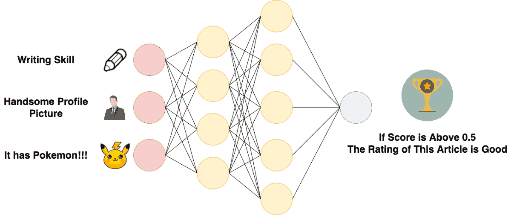
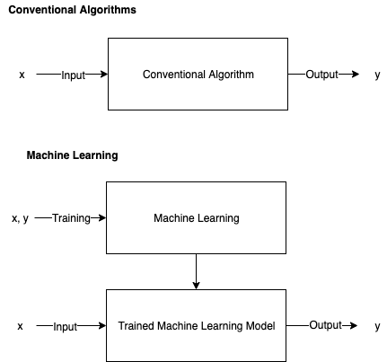
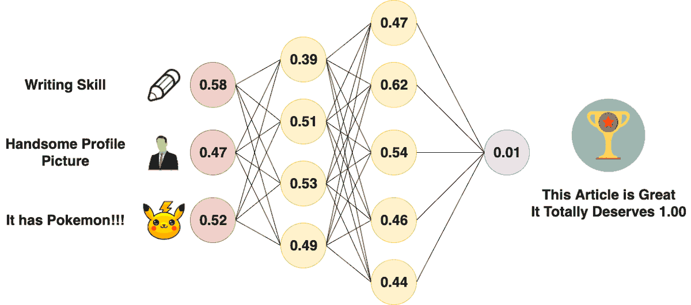
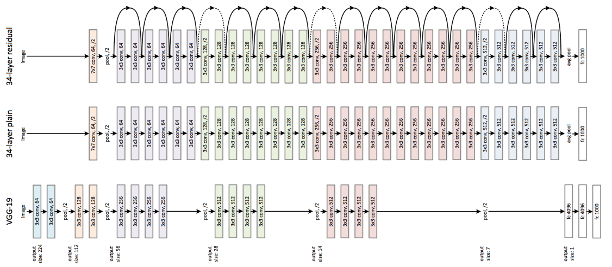
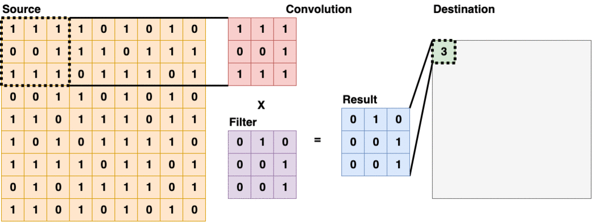
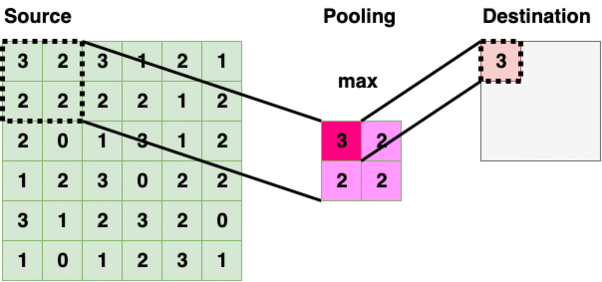
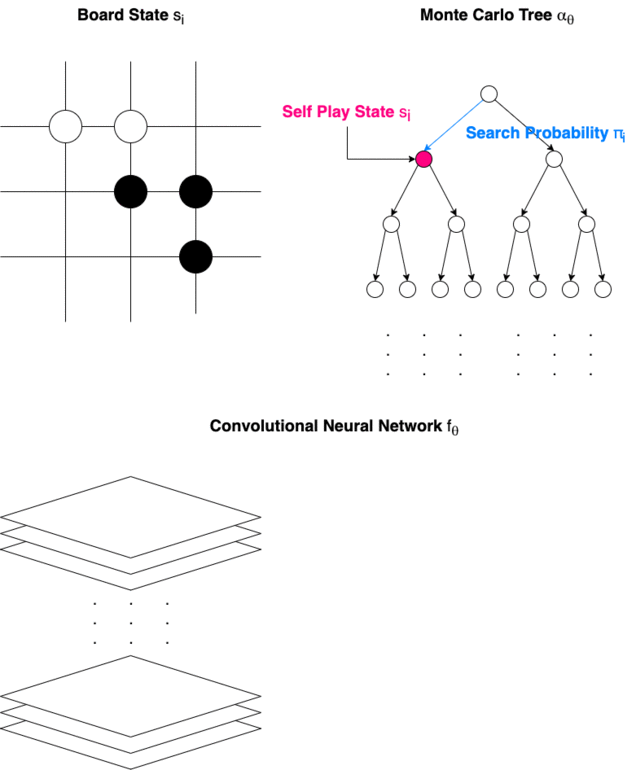

# 作者注

我花了一些时间才能完成本文的第二部分。 我正忙着上学和找工作。 我是人机交互（HCI）的硕士课程，但是对许多不同的领域感兴趣。 人工智能就是其中之一。 希望本文对您有任何帮助。 另外，我非常需要一份工作，所以请告诉我您是否有适合我的工作。 写作也是我的爱好，因为我喜欢弄清楚事物并与他人分享，因此如果您在Medium上关注我，您会发现更多类似的事情。

“未来掌握在您和我的手中，我们将携手使明天变得更美好。”

—沉煌，本文作者

> Forward Propagation of Artificial Neural Network


反向传播和成本函数

正向传播基于权重，偏差和激活函数，但是由什么决定这些值？ 激活功能是预先选择的，但是对于大型神经网络，将无法手动选择适当的权重和偏差。

在机器学习领域，模型应该从数据本身“学习”，这种学习过程也称为“训练”。 通常，数据被分为2个不同的集合-训练集和测试集。 训练集用于将模型“训练”为更成熟的状态，然后性能将由测试集评估。

> Comparison Between Conventional Algorithms and Machine Learning


有很多不同的方法可以“训练”人工神经网络，但是最受欢迎的方法是反向传播。

在反向传播之前，通常以正态分布随机初始化神经网络的权重和偏移。 然后，神经网络将执行正向传播。 由于权重和偏差是随机初始化的，因此第一次正向传播的结果通常很遥远。 然后使用成本函数来计算预期结果与神经网络输出之间的差异。 计算出差异后，将用于调整上一层的权重和偏差。 该过程逐层向后传播，因此被称为“反向传播”。

> Back Propagation of Artificial Neural Network


这是有关反向传播的更正式的教程，因为它需要一些高级数学来解释。 在这里可以找到神经网络的解释和代码示例，作者使用矩阵运算来模拟Python中的神经网络。
## 卷积神经网络（CNN）

为了更好地处理图形数据，Yann LeCun于1994年发明了卷积神经网络。该网络在2D阵列上对空间信息进行计数。 卷积神经网络也非常适合分析空间信息至关重要的其他2D数据，包括棋盘。

卷积神经网络由3种类型的层构成-卷积层，池化层和完全连接层。 这些具有不同形状和大小的图层在不同主题上的表现将有所不同。 卷积神经网络的研究通常涉及调整这些层及其组成，以优化目标数据集的性能。

> Example Architecture of Convolutional Neural Networks


卷积层（conv）

卷积层通常显示为卷积神经网络的第一层。 这些类型的层将使用过滤器扫描源层，并将总和放入目标层。 有些过滤器擅长检测边缘，有些过滤器擅长其他任务，有关各种卷积过滤器及其在“计算机视觉”中的应用的更多详细信息，请参见此处。

> Convolutional Layer (3x3)


池化层（池）

> Pooling Layer (2x2 — Max Pooling)


池层遍历源层，并在有界区域内选择一个特定值。 该值通常是该区域内的最大值，最小值，平均值。 将信息缩小为较小的大小也称为“下采样”。

全连接层（fc）

完全连接层本质上是一个多层感知器，有时被称为“ softmax”，并且其本质上称为“加权总和”。

> Fully Connected Layer is Just an Artificial Neural Network


卷积神经网络最常用于计算机视觉领域，它影响到许多领域，例如电子商务，金融科技，游戏人工智能，癌症检测，骨科，精神病学，野火检测等。 这是一篇有关计算机视觉如何影响电子商务的文章，另一篇是关于计算机视觉中一些很酷的前端框架的文章。
# Alpha Go Zero，通过机器学习掌握Go游戏

“完美，完美无瑕。 …我认为我一生都无法赶上它。”

-柯洁（Go的世界冠军）在输给Alpha Go Zero的三场比赛后

恭喜！！！ 我们已经到了本文的目的。 现在，我们将准备了解传说中的国际象棋和围棋AI从头到脚的工作方式。

Alpha零设计架构

Alpha Go Zero由卷积神经网络和蒙特卡洛树组成。 它使用强化学习算法进行自我训练。

> How Alpha Go Zero Makes a Turn


我们应该熟悉几个术语。 由于Medium不支持大多数字母的下标，因此类似于LaTeX，下标由“ _”后方括号内的字母表示。
+ 状态：游戏的状态由s_（t）表示，从s_（0）到s_（T），其中s_（T）是终止状态。
+ 蒙特卡洛树（α）：蒙特卡洛树α_（θ）用于确定游戏的下一个状态。
+ 移动（a）：每个状态s_（t）的移动a_（t）由搜索概率π_（t）确定。
+ 搜索概率（π）：搜索概率π_（t）用于确定状态s_（t）的移动a_（t）。
+ 卷积神经网络（f）：卷积神经网络f_（θ）用于通过分析电路板来输出值向量v和策略向量p。
+ 值向量（v）：值向量v_（t）表示当前玩家在位置s_（t）获胜的概率
+ 策略标量（p）：策略标量p_（t）表示移动的概率分布。
+ 优胜者（z）：将优胜者z传播回去训练模型。

Alpha Go Zero完全通过自我游戏进行训练，并且仅使用1个卷积神经网络，而原始的Alpha Go则需要2个卷积神经网络，并从专业的人类游戏中借鉴信息。

Alpha Go Zero将游戏板作为卷积神经网络的原始输入。 然后，网络输出向量v和标量p。 然后，将蒙特卡洛树（Monte Carlo Tree）用于计算搜索概率π，该搜索概率π用于确定游戏下一阶段的移动。 最后，获胜者z由游戏规则确定，并用于通过强化学习来训练模型。

到目前为止，我们已经了解了Alpha Go Zero的工作原理！！！ 更重要的是，我们已经进入了人工智能领域。
# 人工智能，现在与未来

“记下我的话-A.I. 比核武器要危险得多”

-Tesla和Space X的首席执行官Elon Musk，OpenAI的联合创始人等等。

我们在人工智能方面的研究处于有趣的状态。 在机器学习之前，所有的AI都经过硬编码以按照我们期望的方式运行。 机器学习使AI能够独立改善自身，有时会产生意外行为。 研究人员观察到，通过将智能代理置于环境中并通过一定的规则对其进行奖励，可以逐渐增加其智能行为。 这让人着迷，但令人恐惧。

游戏环境内部的研究就像数学和物理学一样。 就其本身而言，这样的研究可能只是想知道并且很想尝试，但缺乏任何扎实的价值。 但是，它们将为其他更多应用科学和工程学提供必要的基础。 未来掌握在您和我的手中，我们将携手使明天变得更美好。
# 了解AlphaGo：AI如何思考和学习（高级）
```
(本文翻译自Shen Huang的文章《Understanding AlphaGo: how AI thinks and learns (Advanced)》，参考：https://towardsdatascience.com/understanding-alphago-how-ai-thinks-and-learns-advanced-d70780744dae)
```
