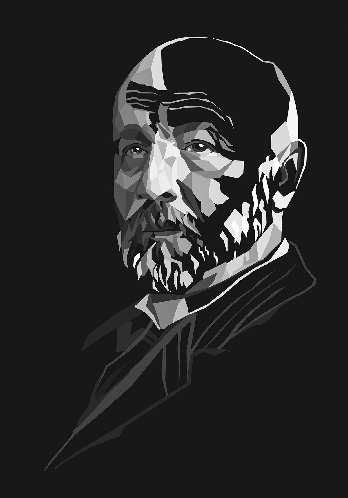
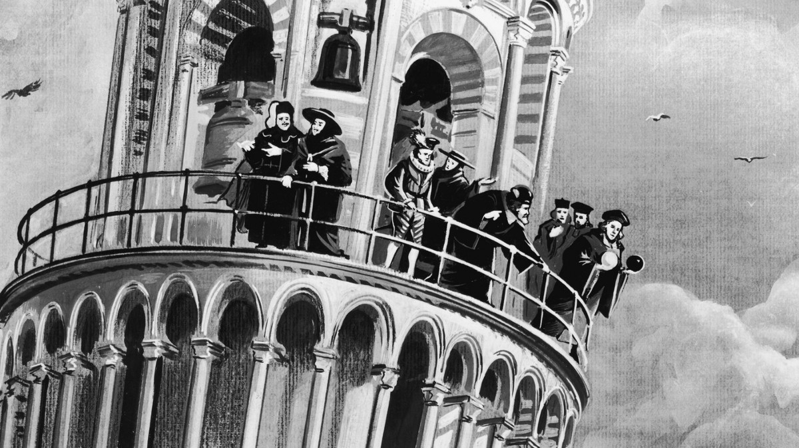
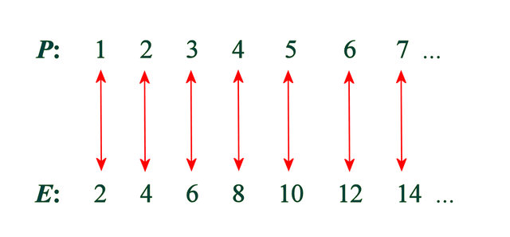
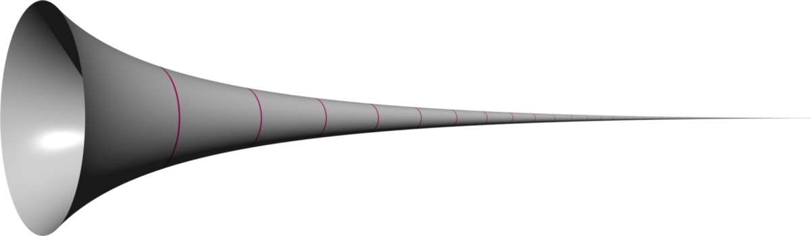
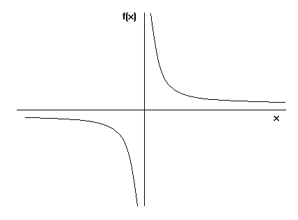
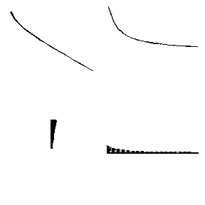
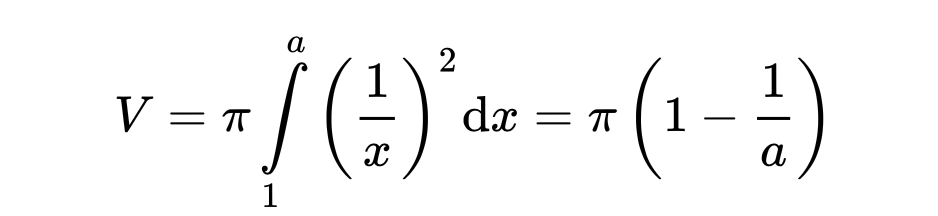
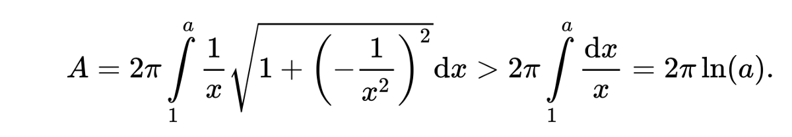

# 了解康托尔的数学无穷大

> Illustration of Georg Cantor by Maney Imagination


伽利略通常被认为是现代科学之父。 他是将实验，理论和数学原理整合到一个标准框架中的人。 伽利略是负责发展现代科学的人，可能比任何人都多。

据说伽利略号从比萨斜塔上落下了两个质量不同的钢球，但材料相同，它们同时降落。 该实验的显着之处在于他引入了一种新的科学方法，您可以在其中进行实验以检验假设。 他表明，我们要做的不只是认为某件事是真实的，还需要证明这一点。

> Most historians agree that Galileo’s famous experiment atop the Leaning Tower of Pisa never took place.


伽利略（Galileo）在比萨大学数学系系主任期间发现了一个有趣的悖论。

定义：悖论，也称为对立，是一种逻辑上自相矛盾的陈述，或者与人的期望背道而驰的陈述。 （维基百科）。 （希腊语：“ para” =超越，“ doxa” =信念）

伽利略的悖论在于确定包含无限对象的两个集合是否彼此等效。 例如，令P为正整数集合，其中P = {0,1,2,3，…}，E为偶数集合，其中E = {0,2,4,6，…}。 伽利略声称这两个集合的大小将是相同的，因为我们可以将集合P中的每个正整数与集合E中的偶数配对。


那么，当E中出现“更少”的数字时，两组的大小如何相同？ 这被称为伽利略悖论，并引发了有关无限概念的新辩论。

伽利略之后，他的学生Evangelista Torricelli成为比萨大学数学系主任。 您可能已经听说过他，因为他在大气压力方面的工作以及气压计的发明。 由于Toricelli也对数学感兴趣，因此他问：

有可能具有有限体积和无限表面的对象吗？ 首先，对于我们大多数人来说，这样的事情似乎不太可能。 但是，数学告诉我们这种事情可能发生。 Torricelli亲自回答了他的问题，并发现了Toricelli的小号，其表面积是无限的，但是体积是有限的。 他的发现被视为“令人难以置信的”悖论。

> Gabriel’s Horn or Toricelli’s Trumpet


顺便说一句，数学哲学中有一个基本规则。 无论您处理的是哲学时代还是数学时代，它都与该地区的历史，文化和宗教有关。 这就是为什么他们称Toricelli的喇叭也叫Gabriel的Horn。 这里提到圣经是因为基督徒相信天使加百列会在审判日吹响号角。

那么Torricelli的喇叭形又如何呢？ 我们都知道如何绘制y = x。 如果用等式y = 1 / x绘制图形，其中x大于或等于1，则该图形将如下所示：

> The graph of y=1/x, x>1.


当我们拍摄y = 1 / x的图形并将其绕x轴旋转时，我们看到了Toricelli的小号。


幸运的是，我们掌握了一些数学公式，可以计算Toricelli小号的面积和体积。 当我们使用以下积分公式计算小号的体积时，我们得到的是有限的数量。


然而，当我们对小号的表面积应用积分公式时，这一次，其表面积变得无限大。 这个结果有趣吗？


由于Toricelli小号的音量是有限的，因此我们可以用有限的颜料填充它。 例如，假设其容积为100升。 我去Home Depot买了100升油漆，然后加满油漆。 但是，使这一点有趣的是，我将用那100升油漆在无限的表面上绘画。 如今，大多数人将此悖论称为“画家悖论”。

休斯顿，我们在这里遇到了问题！ 在数学上，在实践中不可能实现的情况成为可能。 那么，托里切利的号角怎么会是真实的呢？ 或者，在Galileo的示例中，其中一个集合是另一个集合的子集时，我们如何精确匹配集合的所有元素？

所有这些冲突的原因在于，无穷大的概念与我们所知道的其他概念并不相似，这使许多人感到困惑。 伽利略说他的悖论，

“是的，我的朋友，存在无限。 反对是徒劳的。 我正在研究的集合是涉及无限的闭合集合的示例。 它们从一个点开始，一直延伸到无穷远，但是它们仍然被设置。 但是，我对无穷大的评论和概念必须与有限数量级所使用的评论和概念有所不同。 如果要处理有限的量值，则可以说3公斤小于5公斤，或者32米大于7米。 但是谈到无限，您不能说这个无限更大，更小或相等。”

那就是伽利略的解决方案1600年代。

不幸的是，伽利略的解决方案引发了有关无限性的新辩论。 在坎托分享他的“集合论”之前，数学家和哲学家无法就一个具体的答案达成共识，今天学生在小学学习。

我们可以定期历史化无限概念的发展。 它最初是从Eleatics中学出来的，这是公元前5世纪初期由Parmenides在古镇Elea创办的苏格拉底哲学流派。 这所学校有三位伟大的哲学家，例如芝诺（Zeno），色诺芬（Xenophanes）和帕门尼德（Parmenides）。 在这所学校中，公认的哲学是存在是单数的，没有复数。 芝诺（Zeno）以其在Eleatics上对无限性的悖论而闻名。 公元前300年代后期，亚里士多德（Aristoteles）提出并提出了两个概念来解释芝诺的悖论，即潜在的无限和实际的无限。

潜在的无限是一组数字或一组“事物”，它们连续不断而不会终止，继续或重复自身，而没有可识别的终点。

实际的无限涉及具有起点和终点的空间中的永无止境的集合或“事物”。 从技术上讲，这是一个“完成”的系列，但包含无限数量的成员。

亚里斯多德相信没有实际的无限。 直到1600年代，亚里士多德的这一思想一直主导着哲学界。 然后像库萨（Cusa）和布鲁诺（Bruno）这样的哲学家声称存在实际的无穷大，但是我们无法理解它。 在库索和布鲁诺之后，伟大的思想家斯宾诺莎加入了这个话题。

斯宾诺莎说，我们可以理解无穷大的概念，并对其大小进行排名。 但是，他也表示无法对它们进行数学运算。 例如，他可以加3到5，但不能将一个无穷大加到另一个。

最后，为完成这些辩论，一个漂亮的人格奥尔格·坎托（Georg Cantor）出现并发现了集合论，而集合论仍然是数学的基础。 他用集合论为无穷大讨论设定了最终点。

他向我们展示了一个无限集将比另一个无限集更大或更小。 此外，康托尔声称我们可以加和乘无穷集。 在此之前，人类一直遵循亚里士多德关于无限的思想。 根据亚里士多德的说法，如果我们将数字3乘以无穷大，那么它将再次变为无穷大。 无限会吞没一切。 基于此，他声称只会存在潜在的无限，而不是实际的无限。

但是，康托尔向我们证明了亚里斯多德的理论与集合论相反。 如果我们将一个添加到无限集合中，那么它将不再是同一集合。 他试图比较无穷大。 例如，康托尔证明（0,1）→ℕ的所有函数的集合都是可数的。 因此，他定义了从区间（0,1）到自然数的一对一函数。

换句话说，他证明了全自然数可以在0到1之间拟合，因为在0到1之间有无限个有理数，并且这些无限性可以配对。 然后他做了比找到两个相等的无限更危险的事情。 他比较了实数的无穷大和自然数的无穷大，发现实数的无穷大。 他甚至查看了自己的证据，并告诉他的朋友Dedekind：“我看到了，但即使我也不敢相信……”。

康托尔还是一位数学家，对哲学和宗教问题非常关注。 他说，在发展集合论的过程中，“上帝决定了集合论。”

集合论最初发展时并没有被广泛接受。 公司甚至没有雇用Cantor从事任何工作。 数学家亨利·庞加莱（HenriPoincaré）曾经说过：“关于康托尔的想法是一种严重疾病，一直困扰着数学界。 数学将有一天对待他。” 康托尔不得不去精神病院呆了一段时间，然后死在那里。 但是今天，我们认为他是一个天才。

康托尔是一个孤独的人，处在无限的边缘。 他在有关“无限数”的文章的开头引用了圣经：“所有隐藏的东西都会被发现。”
```
(本文翻译自Waldo Otis的文章《Understanding Cantor’s Mathematical Infinity》，参考：https://medium.com/however-mathematics/understanding-cantors-mathematical-infinity-bc9ffe7465da)
```
