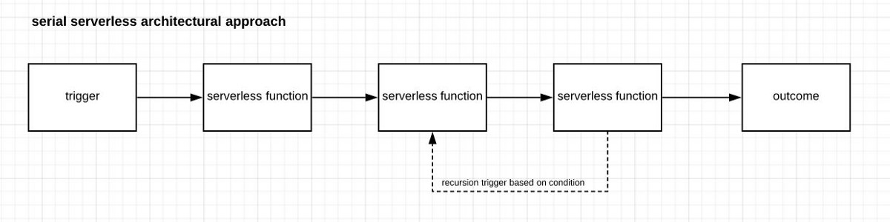
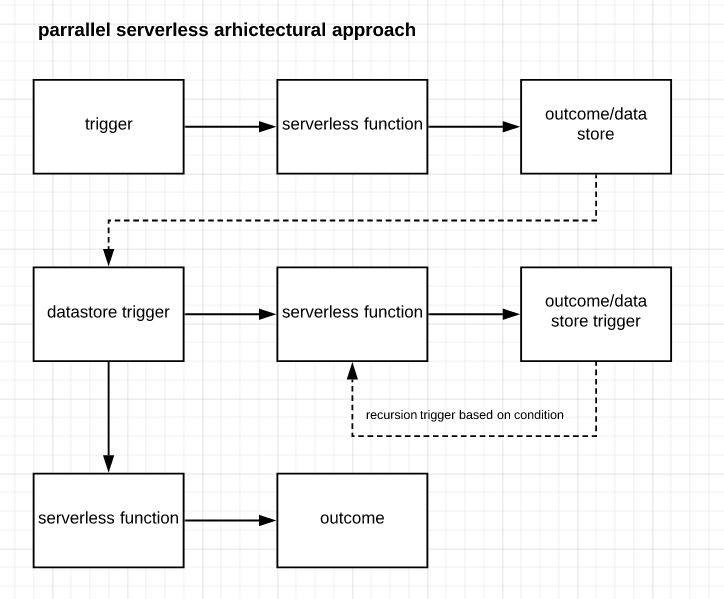
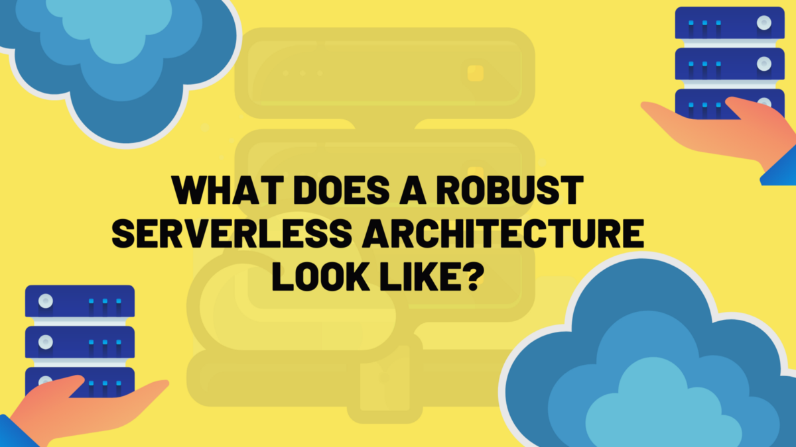

与SRG Software的Dave Wesley合着。

对于健壮的无服务器架构，代码的结构取决于开发人员为更大的视图创建隔离的解决方案的能力。 该代码本质上通常是功能性的，因为可重用性取决于其处理数据的能力而无需基于类的蓝图。

针对大型软件的健壮的无服务器架构会考虑潜在的中断和可能丢失数据的位置。 通过围绕永久性集中触发器，它解决了此问题，并降低了由于无服务器的短暂性而导致的风险。

功能并行是可用于健壮的无服务器体系结构的体系结构方法之一。 关于触发器，实现永久性是数据保护和验证的一种好习惯。 这也是处理无服务器预期的无状态性的一种方法。
# 大自然的整合，隔离和事件驱动

很容易陷入为任何可能的事情编写函数的陷阱。 对于无服务器，很容易启动执行工作的功能。 可以通过自动计时作业激活该作业，可以通过网关，数据更改和代码管道活动来触发该作业。

尽管这对于孤立的案例来说听起来很棒，但是在无服务器环境中的大型应用程序要求架构师将整个预期事件和设计功能视为一个模块化网络。

在某种程度上，以无服务器方式构建应用程序是一种解构的软件开发方法。 它可以部分启动而无需依赖，并提供快速的问题解决方案。

健壮的无服务器架构强制执行一定的代码压缩和模块化，以最大程度地减少相互依赖性。 它的无状态性使功能彼此断开，并且持久性数据源成为真实性的唯一空间。

如果发生故障，链接功能会导致串行多米诺骨牌效应。 对功能之间的关系采用并行方法可减轻这种风险。

看下面的图，例如：

> Serial serverless approach


上面的流程是默认的，我们中的一些人在创建无服务器代码时可能会陷入其中。 这是因为在传统的依赖注入模型中，一个函数触发另一个函数很容易想到。 如果要求合理，我们可以递归进行。 但是，当将其应用于无服务器应用程序时，流程中断最终会导致没有应急计划的结果中断。

这是因为串行方法不能满足每个功能真正独立的需要。 上述方法的触发器是调用另一个的无服务器功能，这意味着它有可能沿管道传递数据而无需验证或进行适当的状态管理。

看下图。 它具有相同的三个无服务器功能，但它们通过有状态触发器相互连接。

> Parallel Serverless approach


这种方法可能看起来更复杂，但是如果您查看潜在的断点在哪里，它们是基于触发器而不是函数。

实施递归时，触发器基于持久性内容，而不是可能会丢失输出的临时空间。

该体系结构还允许运行多个代码。 无服务器及其相关的无表数据存储很便宜。 在某种程度上，这是因为它的初始设计是为了大量使用。

虽然第一个图一次运行一个功能以触发另一个功能，因此似乎使用了较少的计算能力，但第二个图允许两个功能以隔离的方式运行，但仍通过数据触发器保持连接。
# 稳健的无服务器架构是什么样的？
## 如果设计不当，一切都会有怪癖

> Image by Aphinya Dechalert. co-written with David Wesley


无服务器是业界最新的流行语之一-但是，就像技术上的任何事物一样，如果设置不正确，您的开发投资可能像纸牌屋一样崩溃。

现在，所有主要的云播放器都提供某种无服务器架构支持-带有Lambda的AWS，带有云功能的Google和带有Azure功能的Microsoft。 还设计和创建了开源的免费Serverless框架，以帮助开发人员自动化其流程并创建更好的无服务器代码。

无服务器背后的理由是，它是事件驱动的，具有自动扩展的能力，而无需基础架构的设置或干预。 但是，人们经常问的一个问题是：健壮的无服务器架构是什么样的？
```
(本文翻译自Aphinya Dechalert的文章《What Does a Robust Serverless Architecture Look Like?》，参考：https://medium.com/better-programming/what-does-a-robust-serverless-architecture-look-like-977a64fff980)
```
