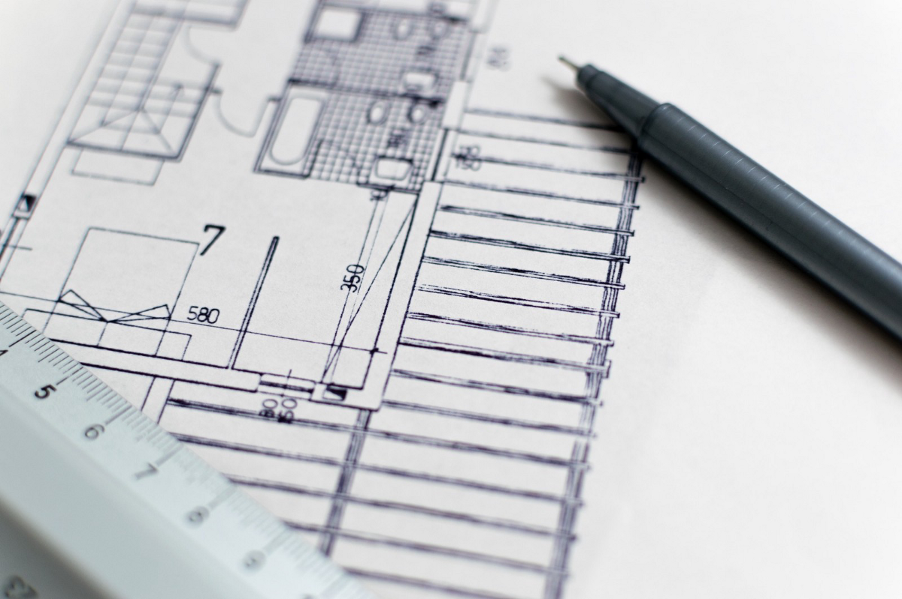

> Photo via Pixabay

# 我们需要什么数据架构？

在大数据和数据科学的新时代，对于企业而言，拥有与业务流程保持一致的集中式数据体系结构至关重要，该体系结构随业务增长而扩展，并随技术进步而发展。 成功的数据架构可以使数据的各个方面变得清晰，从而使数据科学家能够高效地处理可信赖的数据并解决复杂的业务问题。 它还使组织做好准备，以利用新兴技术迅速利用新的商机，并通过管理整个企业中的复杂数据和信息交付来提高运营效率。

与信息体系结构，系统体系结构和软件体系结构相比，数据体系结构相对较新。 数据架构师的角色也很模糊，已经落在了高级业务分析师，ETL开发人员和数据科学家的肩膀上。 尽管如此，我将使用Data Architect来指代那些为组织设计数据架构的数据管理专业人员。

在谈论建筑时，我们经常会想到与建筑的类比。 传统的建筑设计师计划，设计和审查建筑物的建造。 设计过程包括与客户合作以充分收集需求，了解场所的法律和环境限制，并与工程师，测量师和其他专家合作以确保设计是现实的并且在预算之内。 这项工作的复杂性确实与数据架构师的角色非常相似。 但是，两个架构师角色之间存在一些基本差异：
+ 建筑物架构是自上而下设计的，而数据架构通常是可能已经存在的组件或系统的集成过程。
+ 建筑设计师在建造建筑物之前必须了解全部要求并定义整个范围。 数据体系结构的范围可以广泛并且容易更改。 因此，成功的数据架构应设计为灵活的，并可以预见未来的变化。
+ 一名建筑建筑师具有严格的教育和专业要求，并且应在商业，艺术，结构物理和建筑材料方面拥有深入的知识。 另一方面，大多数数据架构师来自IT背景，在一些公司或行业中具有专业经验，并且对业务的了解有限。 因此，他们应该意识到自己的设计可能存在偏差，并且需要根据组织中业务和技术专长的反馈来调整设计。
+ 建筑物设计几乎总是针对从头开始建造的新建筑物。 因此，建筑设计师可以完全根据新要求和新材料进行规划和设计。 数据架构师没有这种奢侈。 他们很少从头开始，但是在设计未来时需要了解现有平台和数据库。

考虑到所有这些差异，数据架构师仍然可以向建筑架构师学习，尤其是采用自上而下的方法来改进数据架构设计。 在许多组织中，缺乏系统的，集中的，端到端的数据体系结构设计。 下面列出了一些主要原因：
+ 一个公司有多个IT部门，他们各自使用各自的数据标准和体系结构工作。
+ 应用程序和流程是根据单个业务需求构建的，没有遵循的数据体系结构标准。
+ 数据架构师的作用是仅关注有限的技术领域，并且对数据拥有有限的业务知识。
+ 管理IT项目时，在设计阶段不考虑数据体系结构； 数据科学家和工程师无需遵循一致的数据管理流程即可编写代码。

由于存在这些不足，我们经常看到一家公司的数据系统脱节，并且团队和部门之间存在差距。 差异导致系统性能低下，需要进行大量交接，在生产数据出现问题时需要较长时间进行故障排除，缺乏在整个系统上找到正确解决方案的责任感，并且缺乏评估产品影响的能力 改变。 最后，脱节的系统在迁移或重新设计到下一代平台时可能会花费大量精力进行分析和研究。

考虑到所有这些，成功的企业需要具有基于业务流程和运营设计的自上而下的一致数据架构。 尤其是，就像建筑架构师所做的那样，企业数据架构师需要先在概念和逻辑级别构建蓝图，然后再将技术应用于详细的应用程序设计和实现。
## 1.基于业务流程和运营的概念级数据架构设计

在现代IT中，业务流程由数据实体，数据流和应用于数据的业务规则支持和驱动。 因此，数据架构师需要具有深入的业务知识，包括财务，市场营销，产品以及业务流程（例如健康，保险，制造商和零售商）的特定于行业的专业知识。 然后，他或她可以通过设计代表每个业务域的数据实体和分类法以及业务流程下的数据流，来在企业级别正确构建数据蓝图。 在此概念阶段尤其需要考虑和计划以下领域：
+ 核心数据实体和数据元素，例如关于客户，产品，销售的数据。
+ 客户和客户所需的输出数据。
+ 要收集，转换或引用的源数据以生成输出数据。
+ 每个数据实体的所有权以及如何根据业务用例使用和分配它。
+ 要应用于每个数据实体的安全策略。
+ 数据实体之间的关系，例如参考完整性，业务规则，执行顺序。
+ 标准数据分类和分类法。
+ 数据质量，操作和服务水平协议（SLA）的标准。

设计的概念级别由支持每个业务功能的基础数据实体组成。 蓝图对于成功设计和实施企业和系统架构及其未来的扩展或升级至关重要。 在许多组织中，这种概念设计通常嵌入到由单个项目驱动的业务分析中，而没有从企业端到端解决方案和标准的角度进行指导。
## 2.逻辑级数据架构设计

通过考虑使用哪种数据库或数据格式，这种设计水平有时称为数据建模。 它将业务需求连接到基础技术平台和系统。 但是，考虑到数据建模者的角色，大多数组织仅在特定数据库或系统中设计了数据建模。 通过考虑适用于每个数据库或系统的标准以及这些数据系统之间的数据流，应采用集成方法开发成功的数据体系结构。 特别是，以下五个领域需要以协同方式进行设计：

命名约定和数据完整性

数据实体和元素的命名约定应一致地应用于每个数据库。 同样，如果相同数据必须驻留在多个数据库中，则应加强数据源及其引用之间的完整性。 最终，这些数据元素应属于数据体系结构中概念设计中的数据实体，然后可以根据业务需求协同准确地对其进行更新或修改。

数据归档/保留策略

直到生产的每个后期，才经常考虑或建立数据归档和保留策略，这会导致资源浪费，不同数据库之间的数据状态不一致以及数据查询和更新的性能不佳。 为了加强数据完整性，数据架构师应基于操作标准在数据体系结构中定义数据归档和保留策略。

隐私和安全信息

隐私和安全性成为逻辑数据库设计的重要方面。 虽然概念设计已定义了哪个数据成分是敏感信息，但逻辑设计应在具有受限访问权限，受限数据复制，特定数据类型和安全数据流的数据库中保护机密信息，以保护信息。

资料复制

数据复制是要考虑三个目标的关键方面：1）高可用性； 2）避免通过网络传输数据的性能； 3）去耦以最小化下游影响。 但是，过多的数据复制会导致混乱，数据质量差和性能下降。 任何数据复制都应由数据架构师检查，并应遵循原则和纪律。

数据流和管道

在此级别上，应明确定义数据在不同数据库系统和应用程序之间的流动方式。 同样，此流程与业务流程和数据架构师概念级别中说明的流程一致。 此外，应在逻辑设计的集成视图中考虑数据摄取的频率，流水线中的数据转换以及针对输出数据的数据访问模式。 例如，如果上游数据源是实时的，而下游系统主要用于具有重索引的聚合信息的数据访问（例如，对于频繁的更新和插入来说很昂贵），则需要在两者之间设计数据管道。 优化性能。
## 3.数据治理是数据架构持续成功的关键。

由于数据体系结构反映并支持业务流程和流程，因此只要业务流程发生更改，数据架构就可能发生更改。 随着基础数据库系统的更改，数据体系结构也需要进行调整。 因此，数据体系结构不是静态的，而是需要进行连续的管理，增强和审核。 因此，应采用数据治理来确保在启动每个新项目时正确设计和实施企业数据体系结构。
# 结论

在成功的数据体系结构中，基于业务流程的概念设计是最关键的组成部分，其次是强调所有数据库和数据管道之间的一致性，完整性和效率的逻辑设计。建立数据体系结构后，组织可以查看哪些数据驻留在何处，并确保数据得到保护，有效存储和正确处理。而且，当一个数据库或组件发生更改时，数据体系结构可以使组织迅速评估影响并指导所有相关团队进行设计和实现。最后，数据体系结构是企业系统的实时文档，可以保证它是最新的，并提供清晰的端到端图。总之，反映端到端业务流程和运营的整体数据架构对于公司在经历重大变化（例如收购，数字转换或迁移到下一代平台）时快速有效地发展至关重要。
```
(本文翻译自Stephanie Shen的文章《What is the Data Architecture We Need?》，参考：https://towardsdatascience.com/what-is-the-data-architecture-we-need-72606e71ba0c)
```
