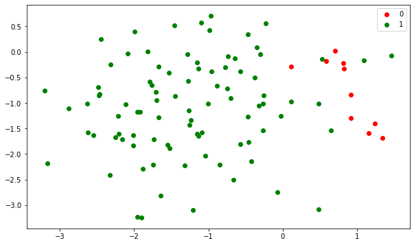
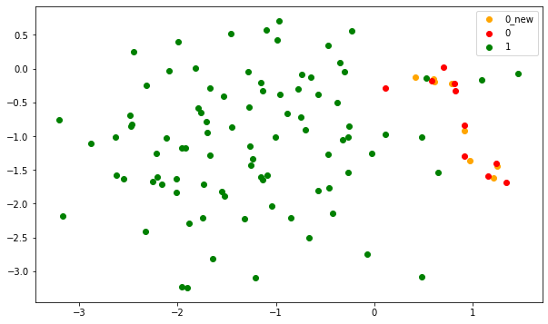
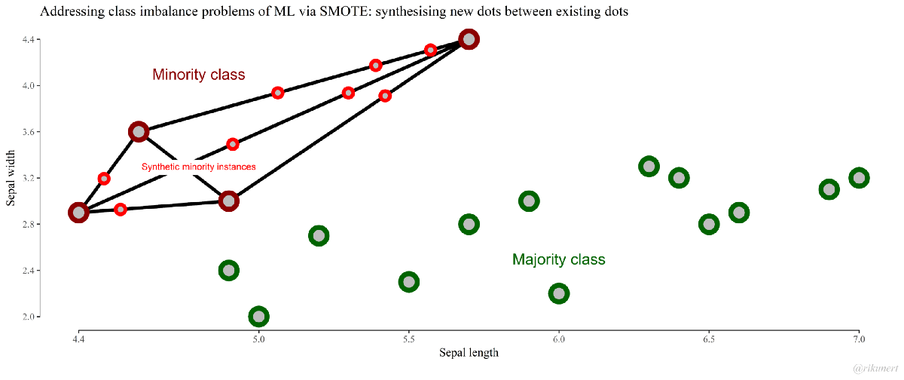
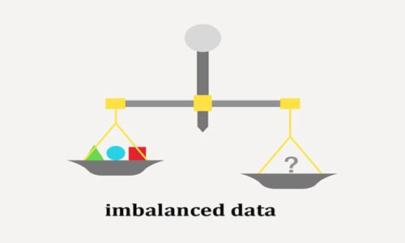

# SMOTE的想法

SMOTE，也称为合成少数族裔过采样技术，正如其名称听起来一样，是对少数族裔类进行过度采样的技术。 它遵循以下步骤：
+ 对于每个少数族裔类别，找到其k最近邻
+ 从其邻居中选择一个，并在邻居和原始点之间画一条线
+ 随机选择直线上的一个点（等于选择一个介于0和1之间的比率参数，然后应用该比率来获得这些点之间的点）
+ 重复直到达到预期的样本数量

因此，逻辑基本上是线性的，实际上所有生成的样本都是现有样本的线性组合。
# 示范

为了清楚地了解这些点是如何产生的，我们来看一个示例以直观地显示该过程。

首先，让我们创建一个不平衡的数据集：
```python
from collections import Counter
from sklearn.datasets import make_classification
from imblearn.over_sampling import SMOTE
import numpy as np
import matplotlib.pyplot as plt

X, y = make_classification(n_classes=2, class_sep=1, weights=[0.1, 0.9], n_informative=2, n_redundant=0,
                           flip_y=0, n_features=2, n_clusters_per_class=1, n_samples=100, random_state=10)

print('Original dataset shape %s' % Counter(y))
# Original dataset shape Counter({1: 90, 0: 10})

label_c = {0: 'red', 1: 'green'}

plt.figure(figsize=[10, 6])
for label in np.unique(y):
    ind = np.where(y == label)
    plt.scatter(X[ind][:, 0], X[ind][:, 1], c=label_c[label], label=label)
plt.legend()
```

看起来像：

> unbalanced dataset


标签0的红点占少数。

要使用SMOTE进行升采样，我们可以在此处使用现有的python包：
```python
sm = SMOTE(k_neighbors=3, sampling_strategy=0.2, random_state=11)
X_res, y_res = sm.fit_resample(X, y)

print('Resampled dataset shape %s' % Counter(y_res))
# Resampled dataset shape Counter({1: 90, 0: 18})
```

其中k_neighbors是上述要选择的邻居数，而sample_strategy = 0.2告诉算法将少数标签采样到0.2 x 90 = 18。

让我们可视化生成的点，
```python
label_c = {0: 'red', 1: 'green'}

plt.figure(figsize=[10, 6])
for label in np.unique(y_res):
    ind = np.where(y_res == label)
    if label == 0:
        plt.scatter(X_res[ind][-8:, 0], X_res[ind][-8:, 1], c='orange', label='0_new')
        plt.scatter(X_res[ind][:-8, 0], X_res[ind][:-8, 1], c=label_c[label], label=label)
    else:
        plt.scatter(X_res[ind][:, 0], X_res[ind][:, 1], c=label_c[label], label=label)
plt.legend()
```


橙色的点是合成的。 您会注意到所有这些点实际上都位于原始点的线之间。 更清晰的演示可以像：

> source: http://rikunert.com/SMOTE_explained


上图显示所有合成实例都是现有实例的线性组合（此处为代码）。

最后，让我们谈谈SMOTE的一些缺点。 首先，原始的SMOTE不支持分类功能。 如您所见，合成数据是通过原始数据的线性组合生成的，因此分类功能在这种情况下不适合。 这里讨论了类似的问答。 其次，次要类别可能不是简单的线性组合，在这种情况下，SMOTE将无助于预测。

参考：

[1] http://rikunert.com/SMOTE_explained

[2] https://zh.wikipedia.org/wiki/Oversampling_and_undersampling_in_data_analysis#SMOTE
# 处理不平衡数据集
## SMOTE介绍

建立机器学习模型时会遇到的一个典型问题是处理不平衡的数据集，其中关注的标签极少，即欺诈检测。 在偏见数据集上直接应用机器学习模型可能会在预测少数族裔标签方面获得不良结果。 原因很简单，因为模型很少看到小班级的训练样本，当然，当出现看不见的数据点时，很难区分它们。

为了解决不平衡数据集带来的问题，将需要更多次要类的数据点。 除了上采样和下采样之类的常规方法外，SMOTE可能是一个更明智的选择，因为它只需重复现有数据即可生成数据点。 在本文中，我们将深入探讨SMOTE的逻辑，并通过直观地查看示例生成来更好地理解。

> source: https://www.nexsoftsys.com/articles/what-is-imbalanced-data.html

```
(本文翻译自Jeremy Zhang的文章《Working with Unbalanced Dataset》，参考：https://towardsdatascience.com/working-with-unbalanced-dataset-8405465630d7)
```
